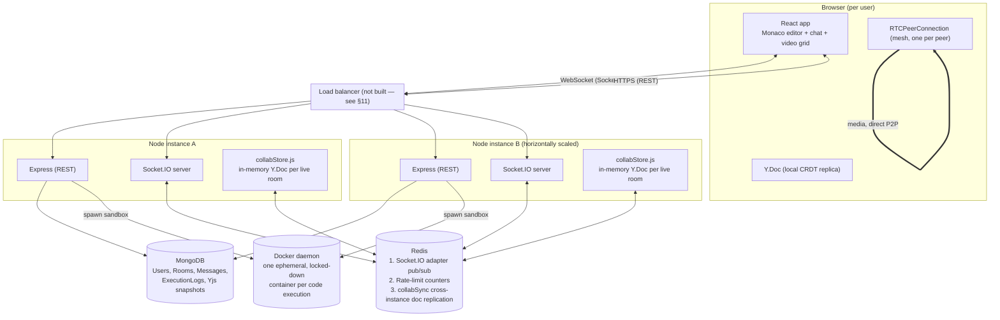

# Architecture & Design Deep Dive

A from-scratch, line-by-line explanation of this project — a real-time collaborative code editor with in-browser video chat and sandboxed Python execution — written to be defensible in a systems-design interview. It covers not just what was built, but why each decision was made, what alternatives were rejected and why, what broke during implementation and how it was diagnosed and fixed, and what the honest limitations are.

**How to use this document in an interview:** each major section ends with the reasoning you'd give if challenged ("why not X instead?"). Section 18 is a dedicated Q&A appendix for the questions most likely to come up. If you remember nothing else, remember that this work found and fixed twelve real, independently-diagnosed bugs — a cross-instance CRDT divergence (§6.5), an awareness-encoding crash (§6.7), an import path that made the whole collab feature unrunnable (§6.8), a broken stdin transport in the sandbox (§7.3), an orphaned-container watchdog gap (§7.6), a Python 3.11 flag compatibility break discovered while adding multi-file support (§7.8), an event-loop-blocking password hashing bug found under load (§13), a client-side library gap that left every collaborator's cursor completely invisible (§9), a React-StrictMode-triggered seeding race that silently served empty documents on every branch switch (§6.4), and three more in the git integration layer — a parent-directory repo silently hijacking every operation, a first-init concurrency race, and an invalid `git merge` flag (all §10.3) — each with a concrete repro, root cause, and a verified fix. "I found real bugs via testing and fixed them, here's the before/after" is a far stronger interview story than "I wrote code and it worked first try."

---

## 1. What this system does

A room-based collaborative workspace: multiple users open the same "room," see each other typing in a shared Python code editor in real time (character-by-character, with live cursors), can run that code and see the output together, chat in a sidebar, and optionally have a video call — all inside the same page, no plugins.

Four capabilities, four different hard problems:

1. **Real-time collaborative text editing** — the classic "Google Docs" problem: multiple people editing the same document concurrently, over an unreliable network, with no data loss and no divergence.
2. **Untrusted code execution** — running a stranger's Python code without letting them read your filesystem, exhaust your host's memory/CPU/PIDs, or reach your network.
3. **Peer-to-peer video/audio** — real-time media between browsers without routing gigabytes of video through your own server.
4. **Ordinary but security-sensitive web app plumbing** — auth, authorization (who's allowed in which room), persistence.

Each is solved with the standard, defensible tool for that specific problem rather than one framework stretched to cover all four — that's the throughline of most of the technology choices below.

---

## 2. High-level architecture



The two Node instances in the diagram are the horizontal-scaling story, exercised for real by `load-tests/node/room-fanout.js`, which boots two genuinely separate OS processes and proves a room stays consistent across both (§6.5, §13).

**Request paths, concretely:**

- **Auth / room management** — plain REST (`server/src/routes/*.js`), JWT-authenticated, stateless, hits MongoDB directly.
- **Live editing** — Socket.IO event stream (`collab:*` events), CRDT updates applied to an in-memory `Y.Doc`, periodically snapshotted to Mongo, replicated across instances via a dedicated Redis pub/sub channel.
- **Chat** — Socket.IO event stream (`chat:*`), persisted per-message to Mongo, broadcast via Socket.IO's own Redis adapter (no custom fan-out needed — see §8 for why chat and collab have different fan-out needs).
- **Code execution** — REST or Socket.IO (`POST /api/execute` or `execution:run`), both funnel into one `executionService.js` that spins up a single-use, network-disabled Docker container per run.
- **Video/audio** — Socket.IO carries only signaling (SDP offers/answers, ICE candidates); actual media never touches the server.

---

## 3. Technology choices vs. alternatives

| Decision | Chosen | Rejected alternatives | Why |
|---|---|---|---|
| Collaborative editing algorithm | **Yjs (CRDT)** | Operational Transformation (OT), locking | See §6.1 |
| Real-time transport | **Socket.IO** | raw WebSocket, Server-Sent Events | Reconnect/backoff, room abstraction, ack callbacks, and a battle-tested Redis adapter for horizontal scaling all come for free. Raw `ws` would mean re-implementing all of that by hand for no gain here — this app has no need for SSE's one-directional simplicity, and it needs bidirectional acks (`collab:join` returns state synchronously to the caller) that SSE can't do at all. |
| Database | **MongoDB** | PostgreSQL | The two write-heavy artifacts here — chat messages and Yjs binary snapshots (`Buffer`/`BinData`) — are naturally schemaless/document-shaped and don't need cross-table joins or transactions. A relational DB would work fine too (this isn't a "Mongo is categorically better" claim) — it's a legitimate toss-up where Mongo's document model matched the data shape slightly more directly, particularly `ydocSnapshots: Map<branch, Buffer>` living right on the `Room` document with no join needed to fetch a branch's snapshot on join. |
| Code sandbox | **Docker container per run** | `vm2`/`isolated-vm` (in-process JS sandboxing), Firecracker/gVisor microVMs, a hosted judge API (Judge0) | See §7.1 |
| Editor widget | **Monaco** (`@monaco-editor/react`) | CodeMirror 6 | Monaco is the actual VS Code editor engine — most recognizable in a demo, first-class Python syntax highlighting, and `y-monaco` gives a maintained Yjs binding. Traded a larger bundle (~3.6MB, bundled locally rather than from a CDN — see §12.1/§14) for that; CodeMirror 6 would have been the leaner, more "modern extensible architecture" choice if bundle size mattered more than demo polish. |
| Client state | **Zustand** | Redux, React Context | A handful of small, independent pieces of client state (auth token, current room, live doc/awareness) with no complex cross-slice orchestration — Redux's ceremony (actions/reducers/middleware) buys nothing here that a few Zustand stores don't already give more directly. |
| Video topology | **Mesh WebRTC** (every peer connects to every peer) | SFU (Selective Forwarding Unit) | See §8.2 |
| Auth | **JWT, stateless** | Server-side sessions | Needs to authenticate both REST calls and the Socket.IO handshake with the same mechanism, and needs to work identically whichever of N horizontally-scaled instances a request lands on, with no shared session store to keep in sync. A JWT the server can verify with just a secret (no DB round-trip) satisfies both for free; sessions would need a shared store (itself probably Redis) for the same horizontal-scaling property, which is strictly more moving parts for the same guarantee. |
| Password hashing | **bcrypt (native)** | bcryptjs (pure JS) | See §6.5 — bcryptjs is what the project started with and it caused a real, measured production-shaped bug. |

---

## 4. Data models

Four Mongoose schemas, all in `server/src/models/`. Each is intentionally minimal — no field exists that isn't read somewhere.

### `User.js`
```js
{
  name: { type: String, required: true, trim: true, maxlength: 80 },
  email: { type: String, required: true, unique: true, lowercase: true, trim: true },
  passwordHash: { type: String, required: true },
}
```
`email` has a unique index — this is what actually enforces "no duplicate accounts" at the database level (the `409 Duplicate value` branch in `errorHandler.js` catches Mongo's error code `11000` from that index, as a second line of defense behind the application-level `findOne` check in `routes/auth.js` — the index is the one that's actually race-condition-proof; two concurrent registrations with the same email can both pass the `findOne` check before either `create()` commits, and the unique index is what turns the second `create()` into a clean 409 instead of a silent duplicate). `passwordHash` is never `password` — the plaintext is hashed with bcrypt before it ever reaches Mongoose and the raw value is never stored, logged, or returned.

### `Room.js`
```js
{
  name: { type: String, required: true, trim: true, maxlength: 120 },
  owner: { type: ObjectId, ref: 'User', required: true },
  members: [{ type: ObjectId, ref: 'User' }],
  language: { type: String, default: 'python', enum: ['python'] },
  ydocSnapshots: { type: Map, of: Buffer, default: () => new Map() },
  gitRemote: {
    url: { type: String, default: null },
    encryptedToken: { type: String, default: null },
  },
}
```
`ydocSnapshots` is keyed by **branch name**, not a single `Buffer` — the direct data-model consequence of branches being per-user (§10.4/§10.9): different users can be live on different branches of the same room at once, so the collaborative doc's Mongo backup has to be per-branch too, or switching back to a branch nobody's currently viewing would have nothing correct to restore from. `Y.encodeStateAsUpdate(doc)` produces a compact binary diff-from-empty that reconstructs a whole document, stored directly as a Mongo `BinData` per map entry. `gitRemote.encryptedToken` is deliberately never included in `toPublicJSON()` below — `gitService.js` is the only code that ever reads it back out (§10.6). `language` is an `enum` with one value today — deliberately future-proofed for more sandboxed runners (`runners/index.js` already has a language→runner registry) without needing a migration when a second language ships. `members` includes the owner implicitly via `isMember()` helper checks (`room.owner.toString() === userId || room.members.some(...)`) rather than always pushing the owner into `members` — avoids a redundant array entry that would need to stay in sync.

### `Message.js`
```js
{
  room: { type: ObjectId, ref: 'Room', required: true, index: true },
  author: { type: ObjectId, ref: 'User', required: true },
  authorName: { type: String, required: true },
  text: { type: String, required: true, maxlength: 4000 },
}
```
`authorName` is deliberately denormalized (copied from `User.name` at write time) rather than always populated via `ref` at read time — chat history renders correctly even if a user later changes their display name or is deleted, and it avoids an extra `populate()` join on every message-list fetch. The `room` field is indexed because every query against this collection is `Message.find({ room: roomId })` (`routes/rooms.js`, `chatHandlers.js`) — without the index that's a full collection scan as chat history grows.

### `ExecutionLog.js`
```js
{
  room: { type: ObjectId, ref: 'Room', required: true, index: true },
  user: { type: ObjectId, ref: 'User', required: true },
  language: String, code: String,
  files: { type: Mixed, default: undefined }, entryPath: String, stdin: String,
  stdout: String, stderr: String, exitCode: Number, timedOut: Boolean, durationMs: Number,
}
```
An audit trail: every execution tied to a room persists the code that ran and its full result. `files` is only set for multi-file runs (§7.8) — `code` alone already captures the single-file case, so `files` stays `undefined` rather than a redundant one-entry map. This is written from `executionService.js` after every run that has a `roomId` (solo executions via the API with no room context — possible per `routes/execute.js` — aren't logged, since there's no room to attach the audit trail to and no other user who'd need to see it).

All four schemas use Mongoose's `{ timestamps: true }` for free `createdAt`/`updatedAt`, and each has a `toPublicJSON()` instance method — the one place that decides what a client is allowed to see (e.g. `User.toPublicJSON()` omits `passwordHash` entirely; routes always send `.toPublicJSON()`, never the raw Mongoose document, so a future field added to a schema doesn't leak by default).

---

## 5. Auth subsystem

`routes/auth.js` + `middleware/auth.js` + `utils/jwt.js`, three files, deliberately small.

**Register** (`POST /api/auth/register`): validates inputs by hand (email regex, `password.length >= 8`) rather than pulling in a validation library for three fields — proportionate to the actual surface area. Hashes with `bcrypt.hash(password, 10)` (§6.5 covers why `bcrypt` and not `bcryptjs`, and what 10 rounds costs). On success, signs and returns a JWT immediately — register-then-immediately-authenticated, no separate login round-trip required. Both `/register` and `/login` sit behind a per-IP rate limit (`AUTH_RATE_LIMIT_PER_MIN`, default 30/min, reusing the same Redis-backed `checkAndConsume` the execution endpoint already used — §7.5) added during this project's production-hardening pass (§16) — brute-force/credential-stuffing protection that didn't exist before. The number itself came from a real tuning finding, not a guess: an initial 10/min broke this project's own e2e suite and a local load-test harness, both of which legitimately register many users in quick succession from one machine/IP — exactly the shared-IP (NAT, campus network, CI runner) scenario a real deployment needs to tolerate. 30/min still meaningfully throttles a scripted attacker while comfortably covering that case.

**Login**: looks up by lowercased email, `bcrypt.compare(password, user.passwordHash)`. Both "no such user" and "wrong password" return the identical `401 Invalid credentials` — never `404 Unknown user` — a standard defense against username enumeration (returning different errors for "you have an account" vs. "you typed the password wrong" lets an attacker enumerate valid emails for free).

**Token** (`utils/jwt.js`): `jwt.sign({ sub: user._id, name, email }, JWT_SECRET, { expiresIn: '7d' })`. Putting `name`/`email` in the payload (not just `sub`) means `requireAuth` and the Socket.IO auth middleware can populate `req.user`/`socket.user` with zero extra DB round-trips per request — a deliberate latency/staleness tradeoff: if a user changes their name mid-session, sockets carrying an old token show the old name until they reconnect. Given a display name is low-stakes, that's an acceptable trade for cutting a DB read off every single authenticated request.

**Verification, twice, one mechanism**: `middleware/auth.js` (`requireAuth`) checks the `Authorization: Bearer <token>` header for REST; `sockets/index.js`'s `attachSocketAuth` checks `socket.handshake.auth.token` for the WebSocket handshake. Both call the exact same `verifyToken()` — one secret, one verification path, used at two different transport layers. This is the direct payoff of choosing stateless JWT over server-side sessions (§3): a session-cookie approach would need an entirely different mechanism for the Socket.IO handshake (cookies aren't naturally available there in the same way), or a shared session store just to make the two transports agree on who's authenticated.

**Threat model, honestly**: a JWT is a bearer token — anyone holding it is treated as that user for its full 7-day life, and there's no server-side revocation list, so a leaked token stays valid until it expires (this is the standard JWT tradeoff, not unique to this project). No refresh-token rotation exists — see §14 known limitations.

---

## 6. Real-time collaboration — the CRDT deep dive

### 6.1 Why Yjs (CRDT) over Operational Transformation

Two well-known families solve "many people editing the same document":

- **OT (Operational Transformation)** — the older approach (Google Docs' original engine, ShareDB). Every op ("insert 'x' at position 5") is transformed against every other concurrent op so they compose correctly regardless of arrival order. Requires a **central server that's authoritative and involved in every transform** — the transform function has to run somewhere all clients agree on, which is almost always the server.
- **CRDT (Conflict-free Replicated Data Type)** — Yjs's approach. Every character gets a globally unique, immutable ID (`(clientID, clock)`), and inserts are positioned relative to their neighbors' IDs rather than raw numeric offsets. Two replicas that have seen the same set of operations converge to the identical document **with no central arbiter needed** — merging is a pure, commutative, associative operation on each client.

For this project specifically: the CRDT property that a **client's local edits apply instantly to its own `Y.Doc` with zero round-trip**, and that the server is just one more replica in the mesh rather than a required transform authority, is what makes local typing feel instant regardless of network latency, and is exactly why the server-side `Y.Doc` in `collabStore.js` can be non-authoritative scratch state (rebuildable from Mongo + peers) rather than a single point of correctness truth. The cost, which is real and worth naming in an interview: CRDT metadata (those per-character IDs) grows with edit history and can outlive the content it describes (a deleted character's tombstone ID persists) — Yjs mitigates this with its own internal GC, but it's a genuine space/complexity tradeoff OT-style central-authority systems don't have in the same way.

### 6.2 Why not the standard `y-websocket` protocol

Yjs ships an official `y-websocket` provider and matching server (`y-websocket-server` / `y-redis`). This project does **not** use it — the server already had Socket.IO wired up for chat, execution, and WebRTC signaling before collaboration was added, and Socket.IO gives per-room broadcast, ack callbacks, and JWT-authenticated connections that the collab feature reuses directly rather than running a second, separate WebSocket server on a second port with its own auth story. The cost of that choice is real: it means hand-writing the client-side provider (`client/src/components/CodeEditor/YjsSocketProvider.js`) instead of using the maintained `y-websocket` client, because the wire protocol here (`collab:join`/`collab:update`/`collab:awareness`, JSON envelopes with base64-encoded Yjs binary payloads) is bespoke, not the standard one. That's a deliberate trade of "more code we own" for "one transport, one auth mechanism, one Redis adapter, for everything" — defensible for a project this size; at larger scale, running collaboration on its own dedicated `y-websocket`/`y-redis` deployment (so it can scale independently of chat/exec/signaling traffic) would be the more standard choice.

### 6.3 The protocol, precisely

Four Socket.IO events, `server/src/sockets/collabHandlers.js`, every one of them scoped to a `(roomId, branch)` pair, not just `roomId` — the direct protocol consequence of branches being per-user (§10.4/§10.9): two users in the same room can be viewing different branches at once, so the Socket.IO room name itself is `collab:<roomId>:<branch>`, and a `collab:update` for `"feature"` only ever reaches sockets actually viewing `"feature"`, never a socket sitting on `"main"` in the same underlying room.

- **`collab:join { roomId, branch, awarenessClientID }` → ack `{ doc, awareness }`** (both base64). Authorization check first (`isRoomMember`), then `getOrCreateRoomState(roomId, branch)` (§6.4) either returns that (room, branch) pair's already-live `Y.Doc` or builds one from its Mongo snapshot / git commit tree (plus, critically, a peer-state request — §6.5). The full current state is encoded with `Y.encodeStateAsUpdate(doc)` and sent back through the ack callback — a joining client always gets a complete, consistent snapshot synchronously, not a stream of historical ops it has to replay itself.
- **`collab:update { roomId, branch, update }`** — no ack; fire-and-forget by design, since every client also gets its own edits echoed back to *other* clients, not to itself (that would double-apply). `Y.applyUpdate(state.doc, bytes, socket.id)` applies it to the server's in-memory replica (the `socket.id` as origin is what lets `collabStore.js`'s update listener distinguish "just loaded from Mongo, don't re-save" from "someone actually typed something, do save" — see §6.4), then `socket.to(room).emit(...)` relays the *exact same bytes* to every other socket in that (room, branch)'s room. Yjs updates are inherently incremental binary diffs — the server never has to understand or re-derive them, only pass them through.
- **`collab:awareness { roomId, branch, update }`** — identical shape, for ephemeral state (cursor position, selection, user color/name) via `y-protocols`' `Awareness`. Deliberately **not** persisted to Mongo and **not** replicated cross-instance (§6.6 explains why that asymmetry with `collab:update` is correct, not an oversight).
- **`collab:leave { roomId, branch }`** / the `disconnecting` handler — removes the client from `state.clients`, removes its awareness state (with a guard — §6.7), schedules a snapshot, and tears that (room, branch)'s in-memory state down entirely once its last client leaves (`disposeIfEmpty`). `disconnecting` parses every `collab:*` room a socket was in (`collab:<roomId>:<branch>`) and calls this once per (room, branch) pair — a socket can in principle be joined to more than one branch at once (the client never does this in practice — `BranchWorkspace`, §9, unmounts the old branch's provider before mounting the new one — but the server has no reason to forbid it, and `server/test/gitSockets.test.js` exercises exactly this to observe two branches from one connection).

### 6.4 Server-side state: `collabStore.js`

One `Map<"roomId::branch", RoomState>` per process — not `Map<roomId, RoomState>` — where `RoomState = { doc: Y.Doc, awareness: Awareness, clients: Map<socketId, {userId, awarenessClientID}>, snapshotTimer }`. The composite key is what makes branches genuinely per-user (§10.4): `(roomA, "main")` and `(roomA, "feature")` are two entirely independent live documents, each with its own clients, its own Mongo snapshot slot (`Room.ydocSnapshots.get(branch)`), and its own git-tree fallback seed. This map is **not** authoritative in the CRDT sense (§6.1) — it's a live cache that makes joins fast and lets the server compute a correct initial-sync payload for new joiners without replaying full history. Supporting mechanisms:

- **Debounced Mongo persistence**: any `doc.on('update', ...)` (§6.5 for the redis-sync-triggered ones too) calls `scheduleSnapshot(roomId, branch)`, which sets a single 4-second timer (a repeat call while one's pending is a no-op — `if (state.snapshotTimer) return`) that writes `Room.ydocSnapshots.<branch> = Y.encodeStateAsUpdate(doc)`. Debouncing matters because a real editing session fires many updates per second (every keystroke); snapshotting Mongo on every single one would be needless write amplification for a value that's only read back when that specific branch has zero live clients left.
- **Teardown on empty**: `disposeIfEmpty` destroys the `Y.Doc` and drops the map entry once that (room, branch)'s `clients.size === 0` — an idle branch costs zero server memory beyond its Mongo snapshot, and switching away from a branch you're the only viewer of tears it down immediately rather than leaking one `Y.Doc` per branch anyone has ever opened.

**A fifth real bug, found by React itself**: `getOrCreateRoomState`'s first version published a freshly-created (room, branch) state into the `states` map *before* seeding it from Mongo/git, then awaited the seed. That window — object visible, content not yet loaded — is invisible under a single caller, but React 18's StrictMode deliberately double-invokes a component's mount effect in development (mount → immediate cleanup → mount again), specifically to catch exactly this class of bug. `BranchWorkspace`'s join effect (§9) does this on every single branch open: `collab:join` fires, the cleanup immediately fires `collab:leave`, then a second `collab:join` fires — all three, back-to-back, before the first join's ack can possibly have returned. The second `collab:join` would find the first's (still-empty) state object already in the map, take the early-return path, and encode *that* empty doc into its own ack — the client bound to that ack (the "real," non-cancelled one) would then render the default placeholder file forever, since nothing re-sends the seed once it lands. Reproduced deterministically at the socket level (`server/test/gitSockets.test.js`'s `"survives React StrictMode double-invoking the join effect"`) before touching the fix, exactly the same discipline as every other bug in this document: repro first, then root-cause, then fix, then a regression test that fails without the fix and passes with it.

The fix separates two things that had been conflated: the state object needs to be visible in `states` immediately (a sibling instance's `collabSync` state-response — §6.5 — needs *something* to merge into, and `Y.applyUpdate` is safe to apply into a doc that's still mid-seed locally), but *reading* from that state needs to wait for seeding to finish. A `loading` map keyed the same way holds the in-flight seed promise; every caller for the same key — the original one that's actually seeding, and any concurrent one that finds the object already present — awaits the *same* promise before touching `Y.encodeStateAsUpdate(state.doc)`. The state object being present in `states` early is no longer a signal that it's safe to read; the caller has to check `loading` first. This is the same "store the in-flight promise, not a boolean" pattern `gitService.js`'s `initLocks` already uses for a different concurrency problem (§10.3) — the same shape of bug (two concurrent callers racing to initialize shared state) keeps showing up because it's a genuinely common shape, not a coincidence.

### 6.5 The bug this project found, and the fix — `collabSync.js`

**The bug.** Socket.IO's Redis adapter (`@socket.io/redis-adapter`, wired in `sockets/index.js`) makes `socket.to(room).emit(...)` reach every *browser* connected to that room across every instance — that part scales correctly out of the box. But `collabHandlers.js`'s `collab:update` handler *also* applies the update to this process's own `state.doc` directly, and the original code did nothing analogous for other instances' `state.doc`s. In a horizontally-scaled deployment (two or more Node processes behind a load balancer, sharing one Redis/Mongo — exactly the architecture in §2), a room with clients split across two instances would silently diverge: instance A's server-side doc has the edits; instance B's does not, ever — Socket.IO's adapter only forwards the *event*, not a replay into the receiving instance's own collab store. A **new** client joining on instance B gets whatever's in Mongo (up to 4 seconds stale, per the debounce above) instead of the live document.

This wasn't a hypothetical found by inspection alone — `load-tests/node/room-fanout.js` and `server/test/collabSync.test.js` (§12) both exercise this for real, using genuinely separate OS processes (`child_process.fork`, not two in-process `createSocketServer()` calls — those would share the same `collabStore.js` module-level `Map` and could never have reproduced this). Temporarily reverting the fix and re-running the regression test confirmed it: the joining client's document came back **empty** instead of converged.

**The fix**, `server/src/sockets/collabSync.js`: a second, independent Redis pub/sub channel (`collab:sync`), unrelated to Socket.IO's own adapter, carrying three message types. Every message's `roomId` field is actually `collabStore.js`'s composite `"roomId::branch"` key (§6.4) — `collabSync` itself never parses or cares about the difference, it just treats whatever string it's given as an opaque replication key, which is exactly what let branch-scoping ship with zero changes to this file:

- `update` — published alongside every locally-applied `collab:update`; any other instance currently holding that room live applies it to its own `state.doc` too (with an origin tag, `'redis-sync'`, so it doesn't get echoed back into another `publishUpdate` call — origin-tagging to prevent broadcast storms is the same pattern Yjs itself uses for the `socket.id`-vs-`'remote'` origin check on the client).
- `state-request` / `state-response` — the cold-join handshake. When `getOrCreateRoomState` creates *fresh* state (this instance has never seen this room live before), it publishes a `state-request` and waits a fixed 200ms (`COLLAB_SYNC_TIMEOUT_MS`, env-overridable); any sibling instance that *does* hold this room live replies with its full `Y.encodeStateAsUpdate(doc)`, which gets merged in — Yjs updates are idempotent to reapply, so this is safe whether zero, one, or multiple instances reply.

**The honest tradeoff**: this adds a fixed ~200ms latency to the *first* join of a room on a given process (a cold cache miss), in exchange for eliminating the up-to-4-second staleness window entirely for that case. That's a deliberate choice, not an oversight — it was sized to comfortably exceed one Redis pub/sub round-trip under load while staying well under human-perceptible "did my click do anything" latency, and it only fires on the rare path (a room's first live client on a given instance), not on every join.

### 6.6 Why awareness (cursors/presence) does *not* need the same fix

`collab:awareness` updates are relayed via Socket.IO's Redis adapter exactly like `collab:update`, but deliberately **skip** `collabSync.js` entirely. This isn't an inconsistency — it's correct, because awareness state serves a different purpose than document content: it's inherently ephemeral (who's online, where their cursor is right now), it's never persisted to Mongo (no `awarenessSnapshot` field exists on `Room`, by design), and a late joiner doesn't need historical awareness — they need *current* presence, which arrives naturally the moment every existing client's next cursor move broadcasts. The one thing that *would* need cross-instance replication — the server's own in-memory doc staying consistent for snapshotting/cold-join purposes — simply doesn't apply to a value the server never persists or replays. Adding `collabSync` plumbing for awareness would be complexity with no corresponding correctness gain.

### 6.7 A second bug found in the same file: `encodeAwarenessUpdate` crash on disconnect

While building the regression test above, `leaveCollabRoom` crashed with `TypeError: Cannot read properties of undefined (reading 'clock')` inside `y-protocols`'s own `encodeAwarenessUpdate`. Root cause: that function unconditionally does `awareness.meta.get(clientID).clock` for every client ID it's given, with no null-check — and `awareness.meta` only ever gets an entry for a client once that client has broadcast at least one awareness update (`applyAwarenessUpdate`). A client that joins a room and disconnects without ever moving its cursor (exactly what the collab-sync regression test's clients do — they only send `collab:update`, never `collab:awareness`) has no meta entry at all, and the original `leaveCollabRoom` called `encodeAwarenessUpdate` unconditionally on every disconnect. **Fix**: guard with `state.awareness.meta.has(client.awarenessClientID)` before calling `removeAwarenessStates`/`encodeAwarenessUpdate` at all — if the Awareness instance never knew about this client, there's nothing to announce as removed anyway.

### 6.8 A third, foundational bug: the collab feature couldn't run at all

Before either bug above could even be tested, `sockets.test.js` failed at the module-loading stage with `SyntaxError: Cannot use import statement outside a module`, from `y-protocols/awareness.js`. Root cause: `y-protocols`'s `package.json` declares `"type": "module"` and ships **both** an ESM source file (`awareness.js`) and a CJS build (`dist/awareness.cjs`), routed through the package's `exports` map — but that conditional routing (`require` → `.cjs`, `import` → `.js`) is only wired for the **extensionless** subpath `y-protocols/awareness`. The original code required the literal `y-protocols/awareness.js` (with the `.js` suffix), which the `exports` map routes to a *direct, unconditional* mapping straight to the ESM source, bypassing the require/import conditional entirely. This meant plain `node src/server.js` would have thrown the identical error — the collab feature was not just untested, it was **unrunnable**, and no one had ever actually started this server with the collab handlers wired in before this review. Fix: drop the `.js` suffix in both `collabStore.js` and `collabHandlers.js`'s requires. Verified with a one-line repro (`node -e "require('y-protocols/awareness.js')"` throws; `require('y-protocols/awareness')` resolves cleanly) before touching any application code.

### 6.9 A fourth bug, reported from real use: one user's edits silently vanishing

Reported as "updates aren't real-time, and sometimes the file shows both versions one after another" — the kind of report that sounds like a sync/latency problem and is actually a data-structure problem.

**Root cause.** `ensureDefaultFile()` created the starter `main.py` from *whichever client observed the room's files map to be empty*. Two people opening a brand-new room within the same round trip both see an empty map, so both run `filesMap.set('main.py', new Y.Text(...))`. `Y.Map` resolves that conflict the way a last-write-wins register must: it keeps exactly **one** of those two `Y.Text` objects and discards the other. That's correct CRDT behaviour and the *content* converges fine — but the losing client's editor is still bound, via `MonacoBinding`, to the `Y.Text` instance it constructed, which is now detached from the document. Every keystroke that user types goes into an object no longer reachable from the doc: it produces no update anyone else receives, and no remote update ever arrives back. From the inside it looks exactly like "sync stopped working", for one user, permanently, with no error anywhere.

Confirmed with a standalone two-`Y.Doc` reproduction before any fix was written — it prints `B typing visible to A? false` while A's edits flow to B normally, the precise asymmetry the report described.

**The fix, and a wrong turn worth recording.** The first attempt was to make the *server* seed the default file authoritatively before sending any join ack, so clients never race to create it. That does fix the race — and it broke the git integration, because `seedRoomState` is also the path that hydrates a branch from its git tree: injecting a `main.py` into every room that came up empty corrupted merge/restore for rooms whose real content comes from a commit (`gitSockets.test.js`'s merge/restore case went red). Isolated by stashing just that one file and re-running, which is the cheapest way to attribute a regression to a specific change rather than reasoning about it.

The fix that shipped instead is client-side and self-healing: `CodeEditor.jsx` now observes the files map and re-binds whenever the `Y.Text` at its own path is *replaced* rather than merely edited. Whoever loses the map race re-binds to the winner within a tick and carries on collaborating normally. This is strictly more general than preventing the one race — a `Y.Map` value can also be swapped by a git restore or a concurrent create of the same path, and all of those previously produced the same silent orphaning. `ensureDefaultFile()` was additionally made non-destructive (it never overwrites an existing entry), so the fallback path can't create the hazard it's guarding against.

**A second, unrelated bug found while writing tests for the first.** `disposeIfEmpty()` cleared the pending snapshot timer when the last client left a branch — so any edit made inside the 4-second snapshot debounce window before the final disconnect was silently discarded, and the room reopened without it. It now encodes the final state synchronously *before* destroying the doc and persists that. Found only because a test asserted the reopened room still contained the last thing typed into it, which is a good argument for writing the assertion you actually care about rather than the one that's easy to satisfy.

### 6.10 Presence: who is here, and which file are they in

Two people editing the same project need to see each other, and the awareness channel already carried everything required — it just wasn't surfaced. `activeFile` is now published as an awareness field alongside the existing cursor state (no protocol or server change: the relay forwards awareness payloads opaquely), so a `PresenceList` in the file explorer can show every participant, their color, and the file they currently have open, live. The file tree carries the same signal as colored dots on each path, and clicking a peer jumps to what they're looking at.

Cursor color moved from being keyed by **account id** to being keyed by the connection's **Yjs clientID**. The account-keyed version had a genuinely confusing failure mode during testing: two tabs signed into the same account produced two cursors with an identical name *and* an identical color, which reads as one cursor teleporting between positions rather than two participants — the likely source of a "cursor names are swapped" report. The palette also changed from an eight-entry list to a golden-angle hue walk, because eight colors collide often enough that two different people in one room regularly drew the same color anyway.

An explicit non-bug worth stating, because it was reported as one and tested for directly: a remote cursor has never been able to move a local caret. `y-monaco` renders remote selections as *decorations*, which are painted, non-interactive ranges — they have no relationship to the local editor's selection state. `presence.spec.js` pins this down by parking two users' carets on different lines, moving one, and asserting the other's next keystroke still lands where they left it.

---

## 7. Code execution sandbox — the security deep dive

`server/src/services/runners/*` + `docker/sandbox.Dockerfile`. This is the highest-blast-radius subsystem in the project: it runs a stranger's arbitrary code. §7.2–§7.8 below describe the hardening as it was originally built around `pythonRunner.js`; §7.9 covers how that hardening was generalized to support JavaScript, C, and C++ as well.

### 7.1 Why a Docker container per run, and not the alternatives

- **`vm2`/`isolated-vm`** (in-process JS sandboxing) — not applicable at all here: the untrusted code is Python, not JS, so an in-process V8 isolate can't run it. More generally, in-process sandboxes for *any* language share the host kernel and process — a container gives kernel-level (via cgroups/namespaces) resource and syscall isolation that no in-process sandbox can match for genuinely untrusted code.
- **Firecracker/gVisor microVMs** — the *more* isolated option (see §7.7 for exactly what gap they'd close), rejected here purely on implementation cost/complexity for a portfolio-scoped project — this is the single most honest "with more time" answer to give if asked to defend the choice.
- **A hosted judge API (Judge0, etc.)** — would work, but hands execution to a third party, adds network latency and an external dependency/cost, and removes the interesting systems-design surface area (semaphores, rate limiting, resource caps) this project is specifically demonstrating.

### 7.2 The container hardening, flag by flag

From `pythonRunner.js`'s `createContainer` call:

| Setting | Value | Defends against |
|---|---|---|
| `User: 'sandbox'` | unprivileged, non-root (created in the Dockerfile via `addgroup -S sandbox && adduser -S sandbox`) | Even a full container-escape exploit lands as an unprivileged user, not root — defense in depth if every other layer somehow fails. |
| `NetworkDisabled: true` + `HostConfig.NetworkMode: 'none'` | no network namespace at all | Data exfiltration, reaching internal services (SSRF against your own infra), downloading a second-stage payload. Verified for real: `load-tests/node/execution-saturation.js` attempts an outbound connection from inside the sandbox and gets `OSError: [Errno 101] Network unreachable`. |
| `HostConfig.ReadonlyRootfs: true` | container filesystem is read-only | Tampering with anything on disk, persisting a payload for a future run (each container is single-use and `AutoRemove`d anyway, but this closes the gap even within one run's lifetime). |
| `HostConfig.Tmpfs: { '/tmp': 'size=16m,noexec' }` | the *one* writable path is a small, `noexec` tmpfs | Code can still write scratch files (`open('/tmp/x','w')` works — Python's own tempfile module needs this), but can't write and then execute a binary there — closes the classic "write an ELF to /tmp, chmod +x, run it" escape hatch that a merely-read-only-elsewhere filesystem wouldn't. |
| `HostConfig.Memory` / `MemorySwap` (both set equal, from `EXEC_MEMORY_BYTES`, default 128MB) | hard memory cap, no swap overflow | A memory-bomb crashing the *host* rather than just its own container. Setting `MemorySwap` equal to `Memory` (rather than leaving Docker's default of `2x Memory`) means there's no extra swap headroom to eat into — the cap is exactly what it says. Verified for real: allocating a 500MB `bytearray` gets OOM-killed (`exitCode: 137`) well before it can print anything. |
| `HostConfig.NanoCpus: 500_000_000` | 0.5 CPU hard cap | One execution starving the host (or the other 3 concurrently-running sandboxes — see §7.4) of CPU. |
| `HostConfig.PidsLimit: 64` | cgroup PID cap | Fork bombs. Verified for real: `os.fork()` in a tight loop hits `OSError: Resource temporarily unavailable` after single-digit forks per process (well under the 64 cap — each forked child *also* keeps forking until it too hits the ceiling, which is why the saturation test's captured stdout shows dozens of "stopped after N forks" lines from the various children, not one). |
| `HostConfig.CapDrop: ['ALL']` | every Linux capability dropped | Anything requiring `CAP_SYS_ADMIN`, `CAP_NET_RAW`, etc. — most container-escape techniques rely on a retained capability the base image didn't need to keep. |
| `HostConfig.SecurityOpt: ['no-new-privileges']` | processes inside the container can never gain more privileges than they start with | Blocks setuid-binary privilege escalation even if one somehow existed in the (minimal Alpine) image. |
| `HostConfig.AutoRemove: true` + a `finally`-block `container.remove({force:true})` | container never outlives its single run | No accumulation of stopped containers consuming disk; the explicit forced removal in `finally` is defensive cleanup for the case where something fails *before* the container ever cleanly starts or stops (a bare `AutoRemove` only fires on a normal stop). |
| `Cmd: ['python3', '-E', '-s', '-B', '/code/<entryPath>']` | `-E` (ignore all `PYTHON*` env vars), `-s` (no user site-packages), `-B` (never writes `.pyc` bytecode caches) | `-E`/`-s` close off environment-variable- and site-package-driven injection paths into the interpreter; `-B` is a small footprint reduction. See §7.8 for why this is **not** `-I` (isolated mode) despite `-I` being strictly more restrictive — a real compatibility finding, not a security regression. |

The base image (`docker/sandbox.Dockerfile`) is `python:3.11-alpine` with `nodejs` and `build-base` (gcc/g++/make) layered on via `apk add` — chosen for minimal attack surface (Alpine's package set is deliberately small) over `python:3.11` (Debian-based, much larger), and kept as a **single shared image** across all four languages rather than one image per language, so there's exactly one thing to build, tag, and keep patched in CI/production (§7.9).

### 7.3 Code delivery: a bind-mounted file, not stdin — and the bug that forced this

The original design (per the code comment that was in `pythonRunner.js` before this review) deliberately delivered code via **stdin**, specifically to avoid ever writing untrusted content to the host filesystem or passing it through argv (argv would risk shell-metacharacter injection if ever assembled into a shell string, and a host-mounted file was seen as an unnecessary filesystem touch). That's a reasonable design instinct — and it turned out to be broken in this environment, for a completely unrelated, non-security reason.

**What was found**: every real-Docker test (`pythonRunner.docker.test.js`) failed — not with a wrong answer, but with **empty stdout and a null exit code on every run**, meaning every container was silently timing out. Diagnosis, narrowed step by step (see the diagnostic scripts' reasoning, reconstructed here): `docker run -i` from the CLI, piping the identical code through stdin, worked correctly — so the Docker Engine and the sandbox image were both fine. An `attach`-for-output-only container (no stdin at all) captured stdout correctly through `dockerode`. But writing to the container's stdin through `dockerode`'s hijacked attach socket — the exact mechanism the original code used — silently dropped every byte: the container started, blocked forever reading stdin that never arrived, and eventually hit `EXEC_TIMEOUT_MS`. This isolates the bug precisely to `dockerode`'s (v4.0.12) handling of the *write* direction of a hijacked attach socket against this specific Docker Desktop for Windows build (Engine API 1.54) — a known category of platform/library transport bug, not a logic error in this codebase.

**The fix**: write the code to a per-run temp file (`fs.mkdtemp` under the OS temp dir, mode `0o444`), bind-mount that single file read-only into the container at `/code/main.py` (`HostConfig.Binds: ['<hostDir>:/code:ro']`), run `python3 -I -B /code/main.py` instead of `python3 -I -B -`, and delete the host temp directory in the same `finally` block that already cleans up the container. This preserves every original security property: the mount is read-only (the sandboxed user can read but never modify the code, exactly as stdin's "never persisted, never writable" intent), the directory name is a random UUID per run (no collision or reuse across concurrent executions — this also matters for the concurrency semaphore, §7.4, where up to `EXEC_MAX_CONCURRENT` runs are genuinely simultaneous), and it's deleted immediately after — and it avoids argv entirely (the file *path* is a fixed constant, `/code/main.py`, never the code itself, so there's no shell-escaping surface at all). It's also strictly more portable: it doesn't depend on a specific Docker Engine/`dockerode` attach-hijacking implementation detail working correctly, which is exactly the thing that broke.

### 7.4 Bounding concurrency: the semaphore

`executionService.js` wraps every run in a hand-rolled `Semaphore` (`utils/Semaphore.js`) sized by `EXEC_MAX_CONCURRENT` (default 4) — a simple counter plus a FIFO queue of resolve-callbacks; `acquire()` resolves immediately if under the cap, otherwise queues; `release()` decrements and resolves the next queued waiter if any. This bounds how many Docker containers can be starting/running *at once*, independent of how many HTTP/socket requests arrive concurrently — without it, a burst of simultaneous execute requests would each try to spin up a container immediately, and container creation itself has non-trivial CPU/IO cost, so an unbounded burst could thrash the host before any individual run even gets to its own `NanoCpus`/`Memory` caps. Verified for real under load (`load-tests/node/execution-saturation.js`, 12 concurrent requests against a cap of 4): all 12 succeeded with zero errors, and the individual completion times visibly cluster into three batches (~0.6s, ~1.1s, ~1.7s) — exactly the FIFO-queuing signature you'd expect from a semaphore of 4 processing 12 jobs, not evidence of anything failing.

### 7.5 Rate limiting

`services/rateLimiter.js` — a fixed-window counter in Redis (`INCR` + `EXPIRE` on first increment), keyed per-user (`exec:rate:${userId}`), default 10 executions/minute. Chosen over a sliding-window or token-bucket algorithm for simplicity — `INCR`+`EXPIRE` is two Redis commands and no extra state beyond the counter itself, at the cost of the well-known fixed-window edge case (a user could in principle fire 10 requests at `0:59` and another 10 at `1:00`, getting 20 in a ~1-second window right at the boundary). That edge case is an acceptable tradeoff for a demo-scoped project — a token bucket would close it at the cost of slightly more Redis state and logic. Verified for real: 12 rapid requests from one user get exactly 2 rejected with `429` (requests 11 and 12), matching the configured limit precisely.

This is deliberately a *separate* mechanism from the semaphore (§7.4): the rate limiter is a **per-user fairness/abuse** control (stop one user from hogging the whole system), the semaphore is a **global resource** control (never exceed what the host can safely run at once) — conflating them (e.g. one global counter) would mean one abusive user could still starve every other user out of their fair share of the concurrency budget, while separating them means a well-behaved user is only limited by their *own* rate, not by what a different noisy user happens to be doing at that moment.

### 7.6 A fourth real bug: orphaned containers when the Node process dies mid-execution

Found by noticing a stray `docker ps` entry after a testing session, not by inspection: a `collab-python-sandbox` container was still `running`, 9+ minutes old, empty stdout, `AutoRemove: true` and `PidsLimit: 64` confirming it was a real execution (not a leftover diagnostic script). Root cause: the `EXEC_TIMEOUT_MS` kill is enforced by a `setTimeout` living inside the Node process that called `createContainer`/`container.start()` — if that process is killed or crashes while an execution is in flight (which happened here: a server process was force-killed between test runs mid-execution), the timer that was supposed to call `container.kill()` dies with it. Docker containers don't stop just because the client that started them disconnects, so the container — and whatever code is running inside it — keeps going indefinitely, with nothing left to enforce the timeout at all.

**The fix**: `server/src/services/runners/sandboxReaper.js`, a lightweight best-effort safety net, not a replacement for the per-execution timeout. Every 30 seconds, it lists containers matching the sandbox image and force-kills+removes any older than 3× `EXEC_TIMEOUT_MS` — generous enough to never touch a legitimately-running execution, tight enough that an orphan doesn't outlive a restart cycle by much. It's wired into `server.js`'s startup (and torn down in the graceful-shutdown handler alongside `collabSync`), so a *freshly started* process cleans up orphans left behind by whichever process crashed before it — the honest limitation being that this only helps once *some* process is running the reaper again; if the entire deployment is down, nothing is cleaning anything up until it comes back. A more complete production answer would be an external, always-on reaper (a separate small process or a Docker-level container TTL mechanism) that doesn't depend on the same application process being healthy — noted alongside the rest of §14.

### 7.7 What this does **not** defend against

Said out loud, in an interview, before anyone has to ask: every layer above is Linux-kernel-level isolation (namespaces + cgroups) — a *contained* process, not a *virtualized* one. A kernel-level exploit inside the container (a real syscall-surface vulnerability) is not something `CapDrop`/`ReadonlyRootfs`/etc. can stop, because the untrusted code still ultimately shares the host kernel. Closing that specific gap is exactly what Firecracker or gVisor buy over plain Docker (§7.1) — a microVM (Firecracker) runs a genuinely separate kernel per sandbox; gVisor intercepts and re-implements the syscall surface in userspace so a kernel bug in the *real* kernel is never reachable at all. That's the honest "what I'd add with more time and a production mandate" answer, not a gap this project pretends doesn't exist.

### 7.8 Multi-file projects and stdin

Two features added after the initial build, both touching the same execution path and worth understanding together.

**Multi-file projects.** `executeCode()` (`executionService.js`) now accepts either the original `{ code }` (wrapped internally as a one-entry `{ 'main.py': code }` map — every existing REST/socket caller keeps working unchanged) or `{ files: {relPath: content}, entryPath }`. `pythonRunner.run(files, entryPath, opts)` writes every entry to its relative path under the per-run temp directory (creating subdirectories as needed) before mounting the whole tree read-only, then runs `entryPath` — so `import`s between sibling files resolve exactly like a normal local Python project. The client mirrors this directly: `doc.getMap('files')` is a flat `Y.Map<path, Y.Text>` (`client/src/lib/fileTree.js`) — folders aren't a tracked entity, only implied by paths containing `/` (the same model git uses). This needed **zero backend protocol changes**: `collab:update` already relays *any* Y.Doc mutation, not specifically `Y.Text` ones, so creating/deleting a file (a `Y.Map` mutation) rides the identical relay as a keystroke.

**A real compatibility bug found while wiring this up**: cross-file imports failed with `ModuleNotFoundError`, even though the mounted directory clearly contained the sibling file. Root cause: Python 3.11 changed `-I` (isolated mode, used since the original sandbox design) to also imply the newer `-P` flag, which stops the interpreter from adding the running script's own directory to `sys.path` — a hardening measure aimed at a script picking up a maliciously-named module planted by a *different* trust boundary in the same directory. That threat model doesn't apply here: `/code` is entirely one user's own submitted project, so it's also exactly where their own `import utils.helper`-style intra-project imports need to resolve from — there's no "other" trust boundary in that directory to protect against. Fix: swap `-I` for the more surgical `-E -s` (ignore env vars, no user site-packages) — same meaningful isolation, without the side effect that broke multi-file projects.

**Path validation** (`server/src/utils/safePath.js`, unit-tested in `test/safePath.test.js`): the first time file *paths* — not just content — became user-supplied data. Every path gets turned into a real host filesystem path (`pythonRunner.js`) and, for stdin, part of a shell command string, so `isSafeRelativePath` rejects anything with `..` segments (directory traversal — writing to `../../../etc/cron.d/evil` was a real risk here, not hypothetical, since `path.join(hostDir, relPath)` will happily walk outside `hostDir` given attacker-controlled `relPath`), absolute paths, and anything outside a `[a-zA-Z0-9_./-]` charset — which also happens to make shell-metacharacter injection impossible by construction, not by escaping. Validated once in `executionService.js` (returns a clean `400`) and re-validated defensively inside `pythonRunner.js` itself, since that's the layer that actually touches the filesystem and the shell command.

### 7.9 Multi-language support: JavaScript, C, C++, Go, Rust, Java, C#, TypeScript

The registry pattern (`server/src/services/runners/index.js`, a plain `language → { run }` object) was deliberately structured from the start so a second language would be additive rather than a refactor — this is that addition landing, eventually landing nine languages total on the same shared hardening.

**Extracting the shared container lifecycle.** Everything in §7.2's hardening table, plus the temp-directory staging and output-capture logic, was language-agnostic already — only the `Cmd` array building was Python-specific. `pythonRunner.js`'s body was extracted into `server/src/services/runners/execUtils.js`'s `runInSandbox(files, entryPath, buildCmd, opts)`, which owns every `createContainer` flag from §7.2 unchanged, and calls a `buildCmd({ entryPath, paths, hasStdin })` callback supplied by the caller to get just the language-specific `Cmd`. `pythonRunner.js`, `jsRunner.js`, `cRunner.js`, and `cppRunner.js` are now each ~10 lines — only the `Cmd` construction differs between them, so a future fifth language is the same small addition, not a copy of the hardening.

**JavaScript** (`jsRunner.js`): `node /code/<entryPath>` (or piped through `.stdin` the same way Python is, §7.3). No `npm install` support — `NetworkMode: none` makes that impossible anyway, and it wasn't a goal; scripts run exactly as submitted, same as Python's no-pip-install constraint.

**C and C++** (`cRunner.js`, `cppRunner.js`): a real difference from an interpreted language — the code has to be compiled before it runs, in the same container, in the same `Cmd`: `sh -c "gcc -O2 -o /build/a.out /code/*.c && /build/a.out"` (g++ with `-std=c++17` for C++). All `.c` (or `.cpp`/`.cc`/`.cxx`) files in the submitted project are compiled together into one binary — mirrors how Python's multi-file resolution (§7.8) treats the whole submitted tree as one project rather than requiring a single-file submission.

**Why a second tmpfs mount was needed.** §7.2's `/tmp` is deliberately `noexec` — the sandbox never needed to execute anything it wrote, because Python and (now) JavaScript only ever execute the read-only, bind-mounted `/code` tree. Compiled languages break that assumption: `gcc`/`g++` need to write a binary *and* execute it, and `ReadonlyRootfs: true` plus a `noexec /tmp` leaves nowhere on the whole filesystem that's simultaneously writable and executable. Rather than drop `noexec` from `/tmp` (weakening the existing interpreted-language runs for a property only the compiled ones need), `execUtils.js` adds a second, separate tmpfs at `/build` (`size=32m`, no `noexec` flag) used only by `cRunner`/`cppRunner`'s `Cmd`; Python and JavaScript never reference `/build` at all, so their sandbox is exactly as locked-down as before this change. This doesn't weaken the threat model described in §7.7 — the code compiled and run from `/build` is the *same* untrusted submission that Python/JS already execute directly from `/code`; every other containment layer (no network, dropped capabilities, memory/CPU/PID caps, non-root user) applies identically regardless of whether the binary came from a compiler or an interpreter.

**Compile errors surface as normal output.** `sh -c "gcc ... && ./a.out"` means a failed compile (`gcc` exits non-zero) short-circuits the `&&` — the binary never runs, `gcc`'s own diagnostics land in `stderr` exactly like a Python traceback would, and the run's `exitCode` reflects the compiler's failure. No special-casing was needed in `executionService.js` or the client — a compile error and a runtime error both arrive as `{ stdout, stderr, exitCode, timedOut }`.

**Language selection.** The client no longer hardcodes `language: 'python'` — `client/src/lib/languages.js` maps a file's extension to a language (`.py`→`python`, `.js`/`.mjs`/`.cjs`→`javascript`, `.c`/`.h`→`c`, `.cpp`/`.cc`/`.cxx`/`.hpp`→`cpp`), used both for Monaco's syntax-highlighting mode (`CodeEditor.jsx`) and for which `language` the Run button sends (`ExecutionPanel.jsx`) — so running a project is just "open the file you want to run," not a separate language picker to keep in sync with the file. `executionService.js`'s default-entry-filename logic (used only when a caller sends bare `code` with no `files`/`entryPath`, e.g. the REST API) is keyed the same way (`main.py`/`main.js`/`main.c`/`main.cpp`).

**stdin.** Can't reuse the live attach-socket write path — that's the exact mechanism §7.3 already documents as broken on this stack. Delivered the same way code is: written to a `.stdin` file in the mounted directory, with `sh -c "python3 -E -s -B /code/${entryPath} < /code/.stdin"` redirecting it in. This is the *one* place a shell reappears in the whole execution path, and it's safe specifically because `entryPath` — the only interpolated value — was already validated against the charset above before this string is ever built; the rest of the command is a fixed constant.

### 7.10 Five more languages, and the bug the compiled ones exposed in the shared hardening

Go, Rust, Java, and C# followed the same `runInSandbox(files, entryPath, buildCmd, opts)` extraction as §7.9 — `goRunner.js`/`rustRunner.js`/`javaRunner.js`/`csharpRunner.js` are each a `buildCmd` callback only, same as `cRunner.js`/`cppRunner.js` before them. TypeScript compiles with `tsc --target es2020 --module commonjs` to `/build` and then runs under `node`, same shape as the C-family compile-then-run pattern but without needing `/build` to be *executable* — `node` is the ELF binary the kernel actually execs; the compiled `.js` is just a data file `node` reads, the same relationship `mono`/`java` have to *their* compiled output (§7.10.1 below).

**7.10.1 — A real bug this exposed in code that had been "working" for two languages**: adding Go, Rust — and specifically testing C/C++ again on a from-scratch box — surfaced that `/build`'s tmpfs mount (`execUtils.js`, added in §7.9 for C/C++) was silently `noexec`. It never mattered for C/C++ during their *original* build because Docker's own tmpfs default (`noexec,nosuid,nodev` when no explicit options string is given) happened to go unexercised in whatever manual testing shipped that feature — but a clean CI/EC2 run of `cRunner.docker.test.js` failed every single case with `exitCode: 126` ("permission denied," the standard shell code for "found the file, can't execute it"), and the exact same failure hit Go and Rust's freshly-written tests too, since all four write a native binary to `/build` and exec it *directly* (`/build/a.out`). Java and C# were unaffected by construction, not by luck: `java -cp /build Main` and `mono /build/a.exe` both exec an *interpreter* binary living elsewhere on the (also-noexec, but irrelevant here) root filesystem, which then reads the compiled output from `/build` as plain data — the kernel's `noexec` check only fires on the file passed directly to `execve()`, not on files a running process merely opens and reads. Fixed with an explicit tmpfs options string — `rw,exec,nosuid,nodev,size=300m` — restoring `exec` for `/build` specifically while leaving `/tmp` (never used for anything runnable) locked down exactly as before. The `size=300m` bump (from an original `32m`) is a separate finding, below.

**7.10.2 — A second real bug: Go's cold `GOCACHE` made "hello world" take 20+ seconds**, discovered directly by measurement, not guesswork — a repro script instrumented with wall-clock timing showed `go build` alone taking 20-25 seconds for a one-line `fmt.Println`, and a second variant (deliberately invalid Go, expecting an instant syntax-error failure) *also* hung to the same ~20s wall before failing, which was the tell that this had nothing to do with the size or correctness of the user's own file. Root cause: every execution is a fresh, throwaway container (`AutoRemove: true`, no volume persists between runs — a deliberate security property, §7.1), so `GOCACHE` starts genuinely empty every time, and `go build` — even for a program that imports nothing but `fmt` — has to compile `fmt`'s own dependency graph (`os`, `reflect`, `sync`, `errors`, `unicode/utf8`, `runtime` itself, …) from source before it can even finish *type-checking* the user's file, because Go's toolchain establishes the whole build graph, including the always-implicit `runtime` link, before it gets to the target package. Two fixes landed together: first, `/build` needed to be genuinely big enough to hold that intermediate compilation output (the same `300m` bump from §7.10.1 — the original `32m` `/tmp`-based `GOTMPDIR` was failing with a flatly literal `no space left on device`, a second, distinct symptom from the same root undersizing). Second — and this is the one that actually fixes the *user experience*, not just the test — `docker/sandbox.Dockerfile` now runs one throwaway `go build` of a trivial program *at image-build time*, with `GOCACHE` pointed at a baked-in image path (`/opt/go-cache-seed`); `goRunner.js`'s `Cmd` then does `cp -a /opt/go-cache-seed/. /build/go-cache/` (a local layer-to-tmpfs copy, not a network fetch) before invoking the real `go build`, so the *user's* build only ever has to compile their own small file against an already-warm stdlib cache. Measured before/after on the same EC2 instance: **~22.8s → ~1.5s** for identical "hello world" Go code — an 15x improvement, and the difference between "acceptable" and "looks broken" for a Run button a real person is going to click and wait on.

**7.10.3 — Why this got caught at all**: none of this was visible from a laptop with a working local Docker Desktop and a warm image cache built once, weeks earlier, by hand — exactly the trap §12's testing-strategy table exists to name (a mocked/short-circuited path structurally cannot catch what only shows up against the real thing). It surfaced specifically because this session's own local Docker Desktop became unusable partway through (repeatedly crashing under Windows — a real, if mundane, environment failure, not a code bug) and testing moved to running the *actual* server test suite and a fresh, from-scratch `docker build` directly against the target EC2 instance's Docker daemon over an SSH-tunneled socket — the same daemon, same kernel, same tmpfs defaults production actually runs under. A clean rebuild is exactly what surfaces a silently-wrong default that a long-lived, already-populated local dev image never would.

---

## 8. WebRTC video/audio

`server/src/sockets/webrtcHandlers.js` — deliberately the smallest subsystem in the backend, because its entire job is to be a dumb relay.

### 8.1 Signaling-only design

WebRTC needs two browsers to exchange three things before they can talk directly: an SDP offer, an SDP answer, and a stream of ICE candidates (the negotiated ways two machines behind NATs might actually reach each other). Some rendezvous point has to carry those messages before the direct connection exists — that's *all* this server does for video: `webrtc:join` returns the current peer list in a room, `webrtc:signal { to, data }` is routed to exactly one target socket, `webrtc:peer-joined`/`webrtc:peer-left` announce membership changes. The `data` payload is opaque to the server — it's never parsed, inspected, or stored; it's forwarded as-is. Once negotiation completes, actual audio/video flows **peer-to-peer**, never through this server — a deliberate, load-bearing design property: video is the highest-bandwidth thing in this entire system by a wide margin, and routing it through the server would make server bandwidth (not CPU, not DB) the binding constraint on how many simultaneous video calls the whole deployment could support.

### 8.2 Mesh topology and its scaling ceiling — and the honest alternative

Every peer opens a direct `RTCPeerConnection` to every other peer in the room — for an *n*-person room, that's *n·(n-1)/2* simultaneous peer connections, each participant uploading their own stream *n-1* times (once per peer). This is genuinely fine for small rooms (2-4 people, the expected use case for a pair/small-group coding session) and genuinely bad at any real scale — a 10-person room means each participant uploading 9 simultaneous video streams from their own, likely-modest, upload bandwidth. The standard fix at scale is an **SFU** (Selective Forwarding Unit — e.g. mediasoup, LiveKit, Janus): each participant uploads *once* to a media server, which forwards (not re-encodes) to every other participant, turning the upload cost from *O(n)* per client into *O(1)* per client. Rejected here specifically because it's a separate, non-trivial media server component to run and operate — correctly scoped for "how do you demo real-time collaboration for 2-4 people," and the first thing to say if asked "how would you support 50-person rooms."

### 8.3 Proving it actually works end to end, not just that the signaling code compiles

This subsystem had zero browser-level test coverage until this session — every other feature had an e2e spec exercising the real UI, but video/audio had only ever been checked by hand. `e2e/tests/webrtc.spec.js` closes that gap using Chromium's `--use-fake-device-for-media-stream`/`--use-fake-ui-for-media-stream` launch flags, which substitute a synthetic (but real, decodable) video/audio track for `getUserMedia` — there's no real camera in CI or this environment, but everything *downstream* of the camera (permission grant, `RTCPeerConnection` creation, the offer/answer/ICE exchange over `webrtc:signal`, and actual frame delivery) is exercised for real, not mocked. The assertion that matters is `video.videoWidth > 0` on the *remote* `<video>` tile, not just that the element exists in the DOM — a tile can render with zero dimensions if negotiation silently stalls, so checking for the element alone would have passed even on a broken connection. Two scenarios: two peers joining the same room converge on a live two-way connection (each sees the other's real, decoding video), and a peer leaving cleanly removes its tile for whoever remains — proving `webrtc:peer-left` → `pc.close()` → React state cleanup (`VideoCallPanel.jsx`) actually runs, not just that it's wired up in the source.

---

## 9. Client architecture

React + Vite + plain JavaScript (matches the server's style — see §3). File tree:

```
client/src/
  lib/apiClient.js          REST wrapper (auth/rooms/execute), throws on non-2xx
  lib/socket.js             socket.io-client factory, connects with auth:{token}
  lib/monacoSetup.js        points @monaco-editor/react at the local monaco-editor
                             bundle instead of its CDN default — see §12.1
  lib/fileTree.js           the file tree data model — Y.Map<path, Y.Text> — see below
  lib/awarenessColor.js     deterministic per-user cursor color from their id
  lib/remoteCursorStyles.js injects the CSS y-monaco itself doesn't ship — see below
  store/authStore.js        Zustand: token + user, persisted to localStorage
  store/roomStore.js        Zustand: room list, create/join actions
  hooks/useFileList.js      mirrors the files Y.Map's keys into React state
  components/CodeEditor/
    YjsSocketProvider.js     the hand-written Yjs<->Socket.IO bridge (§6.3)
    CodeEditor.jsx           per-file Monaco model + MonacoBinding lifecycle
  components/BranchWorkspace/BranchWorkspace.jsx  owns one (roomId, branch)'s Y.Doc/provider — see below
  components/FileExplorer/FileExplorer.jsx    file tree UI — create/switch/delete
  components/Chat/ChatPanel.jsx
  components/Execution/ExecutionPanel.jsx     multi-file run + stdin input (§7.8)
  components/VideoCall/VideoCallPanel.jsx    mesh WebRTC (§8)
  components/Git/GitPanel.jsx                commit/history/branches/remote UI (§10)
  pages/{LoginPage,RegisterPage,RoomsPage,RoomPage,AdminPage}.jsx
  App.jsx                   react-router-dom routes + a RequireAuth guard
```

**Ownership boundary, deliberately**: `RoomPage.jsx` owns only the socket connection and which branch is currently selected (`currentBranch` state) — one socket per room session, shared by chat, execution, video, and git, all of which are room-scoped regardless of which branch anyone's viewing. It does **not** own the `Y.Doc` or `YjsSocketProvider` directly; that's `BranchWorkspace.jsx`'s job, one instance per `(roomId, branch)` pair, mounted with React's `key={currentBranch}` so that switching branches means React fully unmounting the old instance (tearing down its provider and socket-event subscriptions) and mounting a fresh one for the new branch, rather than trying to rebind an existing `Y.Doc` to unrelated content. This ownership split is what makes branch switching a genuinely **per-user** action (§10.4/§10.9): two people in the same room can each have their own `BranchWorkspace` instance pointed at a different branch, each with its own independent live collaborative doc — one user switching branches only ever remounts *their own* component tree, never touches anyone else's.

**`YjsSocketProvider.js`** implements the client half of the protocol in §6.3: takes `(socket, roomId, branch, doc)` — one instance per `(roomId, branch)` pair, matching `BranchWorkspace`'s lifecycle above. On `join()`, emits `collab:join { roomId, branch, awarenessClientID }` and applies the ack's full state; wires `Y.Doc`'s and `Awareness`'s own `update` events to `collab:update`/`collab:awareness` emits (both carrying `branch`), tagging nothing extra (the doc/awareness objects carry their own default local origin, distinct from the literal string `'remote'` this code reserves exclusively for updates that arrived *from* the socket) — the same echo-prevention pattern used throughout this project (server-side origin tagging in §6.3, and again for the cross-instance fix in §6.5). One correctness detail worth calling out: `y-protocols/awareness` must be imported via the extensionless subpath (`from 'y-protocols/awareness'`), exactly as fixed server-side in §6.8 — Vite's ESM-aware bundler resolves that path correctly through the package's conditional `exports` map, but it's the same conditional-exports mechanism that broke under plain `require()`, so getting this right on the client was informed directly by already having diagnosed it on the server.

**The file tree** (`lib/fileTree.js`) lives directly in the shared `Y.Doc` as `doc.getMap('files')` — a flat `Y.Map<path, Y.Text>`, not a nested structure; a "folder" is never its own entity, only implied by a path containing `/` (same model git uses — an empty folder can't exist). This is what let multi-file support (§7.8) ship with **zero server-side protocol changes**: `collabHandlers.js`'s `collab:update` relay already applies whatever `Y.applyUpdate` gives it, and a `Y.Map.set`/`.delete` (creating or deleting a file) produces exactly the same kind of Y.Doc update as a `Y.Text` character insertion — the server never needed to learn a new message shape to support it. `useFileList.js` mirrors the map's *keys* into React state (re-rendering `FileExplorer` on add/delete) without re-rendering on every keystroke inside a file's content, which is handled entirely by `MonacoBinding` instead.

**`CodeEditor.jsx`** owns Monaco model lifecycle explicitly rather than relying on `@monaco-editor/react`'s built-in `path`-based model switching: it keeps a `Map<path, monaco.editor.ITextModel>`, creating one lazily per file the user opens, and on every `activeFile` change destroys the current `MonacoBinding` and builds a new one against the newly-active file's `Y.Text` and model. This was a deliberate choice over the library's automatic model management — owning exactly when a binding tears down and rebuilds is easier to reason about than depending on the relative timing of an internal library effect versus this component's own.

**A real bug found here: remote cursors were invisible.** `y-monaco`'s `MonacoBinding` decorates every other connected client's cursor/selection with CSS classes scoped to their client ID (`yRemoteSelectionHead-<id>`, `yRemoteSelection-<id>`) — but, checked directly against the library's source, it ships **no CSS rules for them at all**. The classes exist in the DOM; nothing gives them a color, a border, or a name label, so every collaborator's cursor was completely invisible — not misplaced, just never rendered as anything visible. Two-part fix: `BranchWorkspace.jsx` sets `awareness.setLocalStateField('user', { name, color })` once its provider joins (a color deterministically derived from the user's id via `lib/awarenessColor.js`, so the same person gets the same color across sessions); `lib/remoteCursorStyles.js` watches awareness and maintains one `<style>` tag with a generated rule per connected client (`.yRemoteSelectionHead-<id> { border-left: 2px solid <color>; pointer-events: none }` plus a `::after` name-tag flag), wired in from `CodeEditor.jsx`. Verified directly (not just built-and-assumed): a two-tab check reads the injected `<style>` tag's content and the decoration element's *computed* CSS in the DOM, confirming the right color reaches the right client ID. (`pointer-events: none` on the decoration itself was added later, defensively, after a user asked whether clicking near another collaborator's cursor label could somehow let them "control" it — it can't: nothing in this architecture routes one browser's keyboard input toward another's session, a remote cursor is a pure CSS overlay on the *same* shared editor surface, and clicking near it just moves your own local caret there, exactly like Google Docs. The pointer-events change makes that overlay unable to intercept a click at all, removing any visual ambiguity, even though there was never an actual control channel to worry about.)

**`VideoCallPanel.jsx`** implements the mesh topology from §8.2 directly: on joining, it offers to every peer already in the room (from the `webrtc:join` ack's peer list); it never offers to a peer that joins *after* it, instead waiting passively for that peer's incoming offer — a deliberate one-sided-initiation rule that prevents "glare" (both sides simultaneously sending competing offers), needing no extra negotiation protocol beyond "whoever was already in the room waits."

---

## 10. Version control: git integration

A genuinely separate layer from the live collaborative doc, added after the initial build. The Yjs doc (§6) is the always-flowing, per-keystroke editing surface; git is a deliberately-invoked checkpoint layer a user opts into via Commit/Branch/Merge — the two stay in sync only at those explicit moments, not continuously, and that's a feature, not a gap: nobody wants every keystroke creating a commit.

### 10.1 Why a real git repository, not a bespoke history mechanism

`server/src/services/gitService.js` gives every room an actual on-disk git repository (`GIT_ROOMS_DIR/<roomId>`, via `simple-git`), rather than inventing a custom versioning scheme (e.g. storing numbered Yjs snapshots in Mongo). The reasoning: version history, branching, merging, and diffing are exactly the problem git already solves correctly — reimplementing even a subset (three-way merge, in particular) is a well-known way to introduce subtle correctness bugs for a solved problem. The cost is real filesystem I/O and shelling out to a real `git` process per operation, rather than pure in-memory state — an acceptable trade for correctness on a problem this well-trodden.

### 10.2 The data model: flat file tree in, flat file tree out

Every git operation moves between two shapes: the client's flat `{ path: content }` map (mirroring `doc.getMap('files')`, §9) and a real git working directory. `syncWorkingDir()` makes the working directory exactly match a given file map (writing changed files, deleting ones no longer present) before every commit; `readWorkingTree()` does the reverse after every checkout/merge. Every path — both directions — is validated with the *same* `isSafeRelativePath` (`server/src/utils/safePath.js`) already used for code execution (§7.8): a git commit turns client-supplied paths into real host filesystem writes, exactly the same class of risk as the execution sandbox's file mounting, so it gets the same defense.

### 10.3 Three real bugs found building this, in order of how badly they'd have hurt

**A parent-directory git repo silently hijacked every operation.** `ensureRepo()`'s first version checked `git.checkIsRepo()` (the default `IN_TREE` mode, equivalent to plain `git status`) to decide whether to run `git init`. That mode walks *up* parent directories the same way normal git does — and on this machine, `GIT_ROOMS_DIR` sits under the user's home directory, which is itself the root of a large, unrelated personal git repository. The upward search found that repo and reported "already initialized" before any room's own `.git` ever existed, so `git init` was skipped entirely — every subsequent git command for that room silently ran against the *unrelated home-directory repository* instead. This surfaced as a ~30-second hang (git scanning the entire home directory tree) followed by `index.lock` conflicts, and — caught and reverted immediately, verified via `git diff --cached` before making any further changes — one stray file briefly staged in that real repository. Fixed by checking for `<dir>/.git` directly via plain `fs.access`, which only ever answers "does *this* directory have its own repo," never "is some ancestor a repo." This is the exact same *family* of bug as §6.8's `y-protocols` import path and §7.3's stdin transport — a library or tool doing more implicit discovery/resolution than the code assumed — which is exactly why the fix pattern (replace implicit discovery with an explicit, unambiguous check) is the same each time.

**A concurrency race in first-time repo creation.** `GitPanel.jsx` fires `git:branches` and `git:log` concurrently the instant it mounts, and a user can click Commit around the same moment — for a brand-new room, multiple concurrent `ensureRepo()` calls could all observe "not yet initialized" and race on `git init`'s template-file copies, surfacing as `cannot copy ... fsmonitor-watchman.sample: File exists`. Fixed with a per-room in-flight-promise lock (`initLocks` map in `gitService.js`): the first caller's init `Promise` is stored *synchronously*, before any `await`, so every concurrent caller for the same room gets handed the identical in-flight promise rather than starting a second `git init`.

**`git merge` doesn't have an `--author` flag.** Unlike `git commit`, there's no per-invocation way to attribute a merge commit to a specific person via a command flag — the original code passed one anyway, which made every merge fail (including *non-conflicting* ones), misclassified as a conflict since the actual git process error didn't look like a normal merge result. Fixed with `GIT_AUTHOR_NAME`/`GIT_AUTHOR_EMAIL`/`GIT_COMMITTER_*` environment variables set per-call via `simple-git`'s `.env()`, the standard mechanism for this. (A smaller, related fix in the same area: `core.autocrlf` defaults to `true` on many Windows git installs, silently rewriting LF to CRLF on checkout — set to `false` per room repo so a round-trip through commit/checkout/merge can't corrupt exact file content.)

### 10.4 Branch switching: per-user, not room-wide

The hardest design question in this whole feature, and the one that changed the most during this project: what does "switch branches" mean when the document being switched is *live*, with other people possibly editing it that exact second? An earlier version of this design made branch switching a **room-wide** action — one shared "the room's current branch," so everyone's screen changed together whenever anyone switched. That turned out to be the wrong answer for how this app is actually used: a real request from using it with someone else was "I want to work on a different branch than my collaborator, at the same time, without changing what they see." The current design is genuinely **per-user**.

The data-model piece that makes this possible already exists a layer down (§6.4): `collabStore.js`'s state is keyed by `(roomId, branch)`, not just `roomId`, so `(roomA, "main")` and `(roomA, "feature")` have always been independent live documents as far as the server is concerned — branch scoping was built into the collab layer from the start specifically so the UI-level decision of "room-wide or per-user" could be made independently, and changed later without touching the server's data model at all. What per-user switching actually needed was entirely client-side:

- `RoomPage.jsx` holds `currentBranch` as local component state (default `"main"`) — nothing server-side tracks "this room's current branch," because there isn't one anymore.
- `<BranchWorkspace key={currentBranch} branch={currentBranch} .../>` — mounted with the branch as its React `key` (§9). Switching branches is `setCurrentBranch(newBranch)`, a purely local state update; React does the rest, unmounting the old `BranchWorkspace` (which calls `provider.destroy()`, emitting `collab:leave` for the old `(roomId, branch)`) and mounting a new one (which joins the new one). No server round-trip decides who sees what — the server was never in the business of deciding that in the first place, it just serves whichever `(roomId, branch)` a socket asks to join.
- `git:branch-create` no longer switches anyone's view as a side effect — it just creates the branch and broadcasts that it now exists (`gitRoom(roomId)`, a lightweight room-wide notification channel separate from any branch's collab room, so "a new branch exists" reaches everyone regardless of which branch they're currently viewing). Only the client that *created* the branch calls `onSwitchBranch(name)` afterward, locally — matching `git checkout -b`'s real semantics (the creator opens what they made; nobody else's view moves).
- Merge and restore still mutate a *specific* branch's live doc via `collabStore.replaceFiles()` (unchanged mechanism from the room-wide design, still the right tool: mutate each surviving file's `Y.Text` **in place** rather than replacing the object, so any `MonacoBinding` already bound to it keeps working) — but the broadcast now goes only to `collab:<roomId>:<into-branch>`, reaching exactly the clients currently viewing *that* branch, never a client sitting on a different one.

**This surfaced a real concurrency bug, documented in full in §6.4**: two people opening the same never-before-live branch at nearly the same instant — which, thanks to React StrictMode's dev-mode double-invoked mount effect, happens on *every single* branch open, not just as a rare race — could see the seeded content silently vanish, served as an empty document instead. Fixed there, with two dedicated regression tests (`server/test/gitSockets.test.js`) that fail without the fix and pass with it.

### 10.5 Merge: clean-or-reported, not a conflict-resolution editor

`gitService.merge()` attempts a real `git merge`. On success, the merged tree is broadcast the same way a branch switch is. On a conflict, it **aborts the merge** (`git merge --abort`) and reports the conflicting file list rather than leaving a half-merged working tree or attempting any automatic resolution — this project does not implement a three-way conflict-resolution UI (a substantial feature in its own right, easily as much work as everything else in this section combined). The honest framing for an interview: correctness (never leave the repo in a broken state, never guess at a resolution) was prioritized over completeness (handling every merge outcome gracefully).

### 10.6 Remote: personal access token, not OAuth

"Connect to a real GitHub/GitLab repo" could mean a full OAuth App flow (register an app, handle a callback URL, token refresh) — deliberately not what's built here. A registered OAuth App needs a public callback URL, which doesn't fit this project's actual deployment shape (local/LAN dev use); a **personal access token**, pasted directly into the Remote tab, authenticates over HTTPS the same way (`https://x-access-token:<token>@github.com/...`) with far less infrastructure, at the cost of asking the user to generate and paste a token themselves rather than a one-click "Sign in with GitHub." The token is encrypted at rest (`server/src/utils/tokenCrypto.js`, AES-256-GCM, key from `GIT_TOKEN_ENCRYPTION_KEY`) rather than stored in Mongo as plaintext, and `Room.toPublicJSON()` never includes it — only the (non-secret) remote URL is ever sent to a client. Said plainly rather than oversold: this is meaningfully better than plaintext storage, not a substitute for a real secrets manager — the encryption key itself still lives in server config, so anyone with that env var and database access can still decrypt. A production deployment would want this in a real KMS.

### 10.7 Client: `GitPanel.jsx`

A thin client over the `git:*` socket events (`server/src/sockets/gitHandlers.js`) — four tabs (Commit / History / Branches / Remote), taking `currentBranch`/`onSwitchBranch` as props from `RoomPage.jsx` (§10.4) rather than tracking a branch of its own. All state fetched fresh on mount and re-fetched whenever any `git:*` broadcast arrives (`git:committed`, `git:branch-created`, `git:merged`, `git:pushed`, `git:pulled` — no `git:branch-switched` anymore, since switching is local-only and has nothing to broadcast), so every connected client's view of history/branches stays current without needing per-action optimistic UI logic. It never touches the Yjs doc directly — merges/restores land back as ordinary `collab:update` events for whichever branch they targeted, exactly like any other edit, which is the whole point of routing them through `collabStore.replaceFiles()` server-side rather than handling them as a special client-side case. The branches tab's "Open" button (deliberately not "Switch," to avoid implying it moves anyone else) is the entire UI surface for §10.4's `onSwitchBranch` call.

### 10.8 A testing lesson worth keeping: don't confuse a test bug for an app bug

Worth naming honestly: verifying the full commit → branch → edit → switch → merge flow through the real UI (`e2e/tests/git.spec.js`) initially showed content merging together across every version instead of cleanly replacing — which looked exactly like a `replaceFiles` correctness bug. It wasn't. `server/test/gitSockets.test.js` (driving the same sequence against a raw `Y.Doc`, no browser) already proved the server-side mechanism correct; the actual cause was the *test* pressing `Escape` immediately after `Control+A` to "select all" before typing — Escape cancels an active selection instead of confirming it, silently turning every "select-all-then-replace" into an append. The lesson generalizes: when a server-only test (no browser) proves a mechanism correct and a browser-based test of the *same* mechanism fails, look at the browser test's own actions before the mechanism under test — the bug is much more likely to be in how the test drives the UI than in newly-broken server logic that a lower-level test already exercised. This exact lesson recurred twice more later in the project (§6.4, §16.2) — a pattern worth trusting once it shows up a third time.

### 10.9 One shared working directory, many concurrent branches

A git working directory has exactly one `HEAD` — but §10.4 means different users can be actively committing to *different* branches of the same room at the same moment, and there's only one on-disk checkout per room (`GIT_ROOMS_DIR/<roomId>`) to do it in. `withRepoLock(roomId, fn)` (`gitService.js`) is what reconciles those two facts: a per-room FIFO promise chain — the same "store the tail promise, chain the next call onto it" shape as `initLocks` (§10.3), generalized to run for the room's entire lifetime rather than just its first initialization. Every operation that needs a specific branch checked out (`commit`, `merge`, `createBranch`, `push`, `pull`) runs inside it, so two such operations for the same room can never interleave on the shared checkout — a commit to `"main"` and a concurrent commit to `"feature"` are serialized (one waits a beat for the other), never corrupted. Read-only operations that resolve an explicit ref (`log`, `show`, `getCommitTree`, `listBranches`) deliberately **skip** the lock — `git ls-tree <ref>`/`git show <ref>:<path>` read directly out of git's object database and never touch the working directory or `HEAD` at all, so a client "opening" a branch (§6.4's cold-seed path) never has to wait behind someone else's commit on an unrelated branch. This is also exactly why `getOrCreateRoomState`'s git-tree fallback (§6.4) works correctly regardless of which branch happens to be checked out at that instant: `ls-tree`/`show` don't care.

---

## 11. Horizontal scalability, end to end

Every stateful piece of this system's design was chosen specifically so that adding a second (third, Nth) Node instance behind a load balancer requires zero code changes beyond what's already there:

- **Auth is stateless** (§5) — any instance can verify any request's JWT with just the shared secret; no session affinity needed for REST.
- **Socket.IO's Redis adapter** (`sockets/index.js`, `io.adapter(createAdapter(pubClient, subClient))`) makes `io.to(room).emit(...)` and `socket.to(room).emit(...)` reach sockets connected to *any* instance, not just the one handling the current event — this is what makes chat and WebRTC signaling correctly cross-instance with no additional code.
- **The rate limiter** (§7.5) is Redis-backed specifically so the per-user counter is shared across instances — a per-process in-memory counter would let a user get a fresh quota just by landing on a different instance.
- **The collab layer** needed one more piece precisely because it keeps *server-side* state beyond what Socket.IO's adapter alone replicates — that's `collabSync.js` (§6.5), and it's the one place in this system where "just add the Redis adapter" wasn't sufficient by itself, which is exactly why it's worth being able to explain in detail rather than wave at.
- **MongoDB and Redis are the only two stateful dependencies** in the whole system — every Node instance is otherwise disposable/interchangeable, which is the actual definition of "horizontally scalable" being satisfied here, not just claimed. It's also exactly what makes the AWS runbook in §17.3 a config change (swap connection strings for Atlas/ElastiCache) rather than an application rewrite.
- **The admin dashboard's room/user view is cluster-correct for free** (§16.2) — `io.fetchSockets()`, backed by the same Redis adapter as the rest of this list, gathers matching sockets from every instance transparently. Its metrics counters and log ring buffer are the one piece of this feature that *isn't* — they're in-process, correctly scoped as a known limitation (§14) rather than something the Redis adapter happens to fix too.

### 11.1 From a measured ceiling to 10,000+ users — what's measured, what's extrapolated

`load-tests/node/room-fanout.js`, pushed to find the real ceiling (§13), converged cleanly through **120 rooms × 8 clients — 960 concurrent Socket.IO connections split across 2 real, separate server processes** — before `collab:join` acks stopped returning in time by 1200. That number was measured on **one laptop running the load generator and both server processes at once** — a meaningfully *worse* environment than a real deployment, where each instance would have its own dedicated CPU/RAM and wouldn't be competing with the thing generating the load. Treated as a conservative **floor**, not a ceiling, on real per-instance capacity: **≈480 connections per instance** (960 ÷ 2).

**Extrapolating from there, linearly, per the §11 design** (nothing about adding a Node instance requires touching connection-handling code — every instance runs the identical stack): reaching 10,000 concurrent collaborative-editing connections needs roughly **10,000 ÷ 480 ≈ 21 instances** at this conservative per-instance figure. Real per-instance capacity on dedicated hardware would very plausibly be higher — this number is deliberately the defensible lower bound from an actual measurement, not an optimistic guess, exactly the distinction the load-testing work in this session was scoped to preserve (§13, `load-tests/README.md`).

Two dimensions of "10,000 users" that aren't extrapolated at all, because they're **exact**, not statistical:
- **Code execution**: `EXEC_MAX_CONCURRENT=4` per instance (§7.4, and §11's note above on why this one is correctly per-instance) means 21 instances = **84 concurrent sandboxed executions cluster-wide** — a hard, computable number, not a projection. Whether that's enough depends on what fraction of 10,000 *connected* users are actually mid-execution at any given moment (realistically a small fraction, not all of them at once) — the honest framing is "this is the real ceiling on simultaneous `Run` clicks," not "this is the ceiling on concurrent users."
- **REST throughput**: measured 81.4 req/s per instance at 50 concurrent VUs with 0% errors (§13) — for occasional auth/room-management calls spread across 10,000 users (not 10,000 users all hitting register/login at the exact same instant), this was never going to be the bottleneck; the WebSocket connection count above is the binding constraint by a wide margin.

**The actual bottleneck past ~21 instances, per §11's own design boundary**: not application code, but the two remaining stateful dependencies. Redis pub/sub fan-out volume (every `collab:update`, every `collabSync` cross-instance relay message, every rate-limit check) and MongoDB write throughput (chat messages, execution logs, per-branch snapshot debouncing) both grow with total active users regardless of how many Node instances split the connection load — and both scale independently of the application layer (Redis Cluster, Mongo sharding/replica sets) without touching a single line of `server/src/`, because neither Redis nor Mongo access in this codebase is coupled to a specific instance or assumes a single node. That's the same property that makes the AWS runbook (§17.3) a config change rather than a rewrite, one level further out.

**The one nuance to flag if asked "so can you really add instances for free?"**: two, actually. Socket.IO's long-polling fallback transport (used when WebSocket isn't available) needs sticky sessions at the load balancer, because a single logical connection can span multiple HTTP requests that must all land on the same instance. This project's Socket.IO client config already forces `transports: ['websocket']` everywhere (client and tests alike), which sidesteps the sticky-session requirement entirely by never falling back to polling — a deliberate simplification worth naming as a tradeoff (no polling fallback for clients on networks that block WebSocket) rather than an oversight. Second: the execution semaphore (`EXEC_MAX_CONCURRENT`, §7.4) is a local in-process counter, not Redis-backed like the rate limiter above — so it scales *with* instance count automatically (3 instances = 12 concurrent executions cluster-wide) rather than enforcing one global ceiling regardless of how many instances exist. That's a deliberate difference from the rate limiter, not an inconsistency: the rate limiter's job is per-*user* fairness (must hold regardless of which instance a user's requests land on), the semaphore's job is protecting *that instance's* host resources (CPU/memory a container on *that* machine can actually use) — a value that's correctly per-instance by definition, not a shared cluster-wide fact (§14).

---

## 12. Testing strategy

Four layers, each proving something the layer below it structurally cannot:

| Layer | Tool | Proves |
|---|---|---|
| Unit | Jest (`executionService.test.js`, `semaphore.test.js`) | Individual functions behave correctly in isolation, with dependencies mocked (`getRunner` mocked in `executionService.test.js` so the test is fast and doesn't need Docker) |
| Integration | Jest + `mongodb-memory-server` + real Redis + real sockets (`auth.test.js`, `rooms.test.js`, `sockets.test.js`, `admin.test.js`, `pythonRunner.docker.test.js`, `gitService.test.js`, `gitSockets.test.js`) | Real HTTP requests through the real Express app, real Socket.IO connections through the real handler chain, a real Docker container (`pythonRunner.docker.test.js`), and a real on-disk git repository (`gitService.test.js`, `gitSockets.test.js`) — no mocks anywhere in this layer. This is what caught the collab bugs in §6.4/§6.5/§6.7/§6.8, the sandbox stdin bug in §7.3, and all three git bugs in §10.3: none were visible from unit tests with mocked boundaries. `admin.test.js` boots the socket server with `useRedisAdapter: true` specifically (most other integration tests use `false` for speed) to verify `fetchSockets()`/`socket.data` behave correctly on the real code path production actually runs (§16.2). |
| Cross-instance regression | Jest + `child_process.fork` (`collabSync.test.js`, via `multiInstance.js`) | The specific failure mode that only exists across *genuinely separate* processes — see §6.5 for why an in-process simulation would have missed it entirely. |
| End-to-end (real browser) | Playwright, Chromium (`e2e/`, 17 specs across 11 files) | The thing none of the layers above can: that the actual UI, driven the way a real user drives it (typing into Monaco, clicking Run, reading rendered chat messages, granting a fake camera/mic), produces correct results through the *whole* stack — client bundle, real network round-trips, real DOM, real `RTCPeerConnection` negotiation (§8.3). There's no interactive browser tool in this environment, so this is how "test it in a browser" happens here: a real headless Chromium against the real client dev server and real backend, not a simulation of either. |
| Load/stress | k6 (Docker image) + custom Node harnesses (`load-tests/`) | Behavior *under concurrency and sustained load* — correctness tests all pass with 1 request at a time; load tests are what surfaced the bcrypt latency bug (§6.5... see §13) that no functional test could have found, because every functional assertion about that code was already true, just slow. |

### 12.1 What the e2e layer found

Two real bugs, neither a collaboration-protocol bug — both about the mechanics of testing (and, in the first case, running) a real browser reliably:

- **Monaco loading from a CDN was flaky.** `@monaco-editor/react` defaults to fetching Monaco's editor assets from a CDN at runtime rather than using the `monaco-editor` package already sitting in `node_modules` — functionally fine when the CDN is reachable and fast, but under this environment's network conditions it intermittently left the editor stuck on its "Loading…" placeholder indefinitely, most visible once two browser contexts were loading Monaco concurrently (exactly what `chat.spec.js` and `collab-sync.spec.js` do). Fixed in `client/src/lib/monacoSetup.js`: `loader.config({ monaco })` points `@monaco-editor/react` at the already-bundled local copy instead. This is also the better production default independent of the flakiness that surfaced it — no runtime dependency on a third-party CDN being up. The cost: the production bundle grew from ~2.6MB to ~3.6MB, because bundling Monaco locally pulls in language-mode chunks for every language Monaco ships support for, not just Python — a real, worth-naming tradeoff (§14), fixable with a more targeted import if bundle size became a priority.
- **Reading Monaco's rendered text for test assertions needed care.** Monaco renders each token as its own inline `<span>`, and it renders a typed space character as U+00A0 (non-breaking space) in the DOM specifically to stop the browser from collapsing whitespace visually — neither is a bug in the app, but a first attempt at comparing `page.locator('.view-lines').innerText()` against a plain JS string literal failed in a way that looked, printed to a terminal, byte-for-byte identical to the expected value (a straightforward `.toContain()` assertion kept failing against content that visually matched exactly). The actual mismatch — confirmed by comparing character codes directly rather than trusting the printed diff — was ` ` vs. a plain space at the exact position where a real space had been typed. Fixed by reading `.textContent()` (not CSS-aware `innerText()`) and normalizing ` ` back to a plain space before comparing. A good reminder that a diff that "looks identical" is a strong signal to stop trusting the terminal's rendering and check character codes directly rather than the string's printed form.

- **A real, intermittent (not merely "flaky") bug found by running the same e2e spec twice in a row.** `chat.spec.js` passed cleanly once, then failed the very next run against the same server process, identical steps — the signature of a genuine race, not test noise. `ChatPanel.jsx` used to fire `socket.emit('chat:join', { roomId }, () => {})` and register the `chat:message` listener immediately, without waiting for that ack — harmless-looking, since listener registration is synchronous and happens well before the emit's round trip resolves. The actual gap: the *server* only adds the socket to `chat:<roomId>` once `chat:join`'s handler finishes its own async `isRoomMember` lookup, and Socket.IO never replays a room broadcast to a socket that joins a moment too late — so a message from another member, sent in that narrow window, is dropped permanently for this client, not merely delayed. Fixed by waiting for the `chat:join` ack before fetching history, attaching the live listener, or enabling the send button — closing the window where another member's message could arrive unheard. Confirmed with a 4x `--repeat-each` run (previously failing roughly half the time) passing clean.

`server/test/setup.js` is the shared harness: spins up a fresh `mongodb-memory-server` per test file (isolated, real MongoDB wire protocol, no mocking of Mongoose itself), connects to a real Redis (`db 15`, isolated from dev data), and tears down every opened resource in `afterAll` — including `collabSync`'s own dedicated Redis subscriber connection, which needed its own explicit teardown call after being added (§6.5) or Jest would hang on an open handle after the test run finished.

**Two more testing lessons from the production-hardening pass, both §10.8's pattern recurring**: the new admin-dashboard e2e spec initially failed for two reasons, neither an app bug — a fixed literal room name collided with leftover rooms from previous e2e runs (the persistent e2e Mongo database isn't wiped between runs, by design, per the top of `e2e/tests/helpers.js`; fixed by making the room name unique like every other spec's), and a failed assertion skipped an `await context.close()` that wasn't wrapped in `finally`, leaking an open browser context (and its live socket) into whatever test ran next. Separately, the *first* full e2e run after adding the new auth rate limiter (§15.3) failed a *different*, seemingly unrelated spec each time it was re-run — not flaky in the usual sense, but the limiter correctly throttling the suite's own rapid sequential registrations once the (initial, too-strict) 10/min cap was exceeded across enough spec files; raising the limit to 30/min (§15.3) fixed it for good, and running the full suite fresh confirmed zero flakiness once that root cause was addressed rather than re-run around.

---

## 13. Stress test results (measured, not estimated)

Full detail and the runnable scripts: `load-tests/README.md`. Headlines:

- **Execution sandbox saturation** — all 6 guardrails (§7.2–7.5) held under deliberate abuse: timeout kill (8435ms), OOM kill (`exitCode: 137`), PID-limit fork-bomb containment, network isolation, per-user rate limiting (10/min → 429 on requests 11–12), and global concurrency semaphore queuing (visible in 3 clean batches of 4, matching `EXEC_MAX_CONCURRENT=4` exactly). Re-run after the nine-language expansion (§7.10) against the live EC2 daemon to confirm the larger, exec-enabled `/build` tmpfs didn't weaken any guardrail: all 6 still held (OOM still `exitCode: 137`, network still blocked, fork bomb still capped, rate limit and semaphore both still enforced) — the resource-limit changes were additive for the compiled-language path only, not a loosening of the shared hardening.
- **Full test suite, 116/116 passing across all nine languages** — run natively on the target EC2 instance (co-located with the real Docker daemon, avoiding a Windows-dev-machine-only class of false failures, see §7.10.3) after the multi-language expansion: every unit, integration, and Docker-backed runner test green, including the newly-written `goRunner`/`rustRunner`/`javaRunner`/`csharpRunner`/`typescriptRunner` suites that hadn't existed before this pass.
- **Multi-instance room fan-out, pushed to the real ceiling of a single dev machine** — clean convergence through **120 rooms × 8 clients (960 real Socket.IO connections, split across two genuinely separate server processes sharing this one laptop with the load generator itself)**; `collab:join` acks stopped returning in time by 150×8 (1200 sockets). Cross-instance convergence latency (how long until every client's Yjs doc matches, via the collabSync Redis relay — §6.5) climbs from p95≈510ms at 600 sockets to p95≈800ms at 960 — a real, measurable cost of the cross-instance relay under load, not free, but well within interactive-editing tolerances up to that point. See §11.1 (extrapolation to 10,000+ users) for what this measured ceiling implies at real horizontal scale.
- **Auth/rooms REST load, and a real bug it found**: ramping to 50 concurrent VUs against `bcryptjs` (pure JS) showed `register` p95 latency of **8.18 seconds** and — more tellingly — `create_room`/`list_rooms` (endpoints that touch no password hashing at all) also degraded to **~3s p95**, because bcryptjs's "async" hashing still runs on the single Node.js event-loop thread and was starving every other concurrent request in the same process. Switching to native `bcrypt` (offloads to libuv's real OS threadpool) brought register to 882ms p95 (9.3x) and — the tell that confirms the diagnosis — `create_room`/`list_rooms`, which do zero bcrypt work, dropped to **under 11ms p95** (a 250-300x improvement). Throughput went from 12.2 to 70.2 req/s at the same concurrency. Re-run after this project's later production-hardening pass (§15) added a per-IP auth rate limiter: 517ms/332ms/8.5ms/9.1ms p95 respectively at 81.4 req/s, 0% errors — a further improvement, confirming the hardening work introduced no regression on this path. Running the *same* load test without deliberately raising `AUTH_RATE_LIMIT_PER_MIN` reproduces the rate limiter correctly rejecting the burst instead — the intended behavior of a brute-force defense, and the reason a load generator needs to bypass it deliberately to measure the underlying endpoint's real ceiling (`load-tests/README.md`).
- **Execution endpoint burst** — a semaphore-bound concurrency scenario (16 users, cap of 4) completed 100% successfully with queuing latency, not failures (p95=1.88s); a simultaneous rate-limit-abuse scenario (one user at 20 req/s, far above the 10/min cap) correctly alternated between `200` and `429` once the bucket filled.
- **End-to-end (Playwright, real Chromium)** — all 9 specs pass against the real client + server + Docker sandbox (8 original + a new admin-dashboard spec added in §16): registration/room-creation/join, two-tab live collaborative editing convergence, multi-file projects with cross-file imports, stdin-fed execution, the room-ID visibility/error-handling fix, two-tab chat delivery, code execution including the real ~8-second timeout path, the full commit → branch → edit → switch → merge git flow, and the admin dashboard showing a live room's connected user while being invisible to a non-admin. See §12.1 for the two real *application* bugs this layer found (a CDN-loading flakiness issue, and a whitespace-encoding gotcha in how the tests themselves read Monaco's rendered DOM) and §10.8 for a related lesson about not mistaking a test bug for an app bug — a lesson this session's hardening pass reinforced twice more (§15, §16).

---

## 14. Known limitations & future work

Said proactively, because naming your own system's limits accurately is itself a signal:

- **No TURN server for WebRTC** — only a public STUN server is configured; some NAT topologies (symmetric NAT on both sides) simply cannot establish a direct P2P path without a TURN relay. Production would need a TURN deployment (coturn, or a hosted provider).
- **Mesh WebRTC doesn't scale past small rooms** (§8.2) — an SFU is the standard next step.
- **No JWT revocation / refresh rotation** — a leaked token is valid for its full 7-day life; a refresh-token flow with short-lived access tokens would close this.
- **The collab-sync cold-join hydration (§6.5) adds a fixed ~200ms latency** on a room's first live client on a given instance — tunable via `COLLAB_SYNC_TIMEOUT_MS`, but a fixed timeout rather than an early-resolve-on-first-response design; the latter would be a small further optimization.
- **The Docker sandbox is kernel-shared isolation, not virtualized isolation** (§7.7) — Firecracker/gVisor would close the remaining kernel-exploit surface.
- **The sandbox reaper (§7.6) is a same-process-lineage safety net, not a fully independent watchdog** — it only cleans up orphans once *some* server process is running again; if the whole deployment is down, nothing reaps until it's back up. An external, always-on reaper process would close this gap fully.
- **Fixed-window rate limiting** (§7.5) has the standard boundary-doubling edge case; a token bucket would close it.
- **C# coverage is thinner than the other eight languages.** `csharpRunner.js` (Mono's `mcs`/`mono`) has the same guardrail tests as every other compiled language (compile, run, timeout, stdin) and they pass, but it hasn't had the same volume of real-world exercise as Python/JS/C/C++ — worth extra scrutiny before treating it as equally battle-tested.
- **A gotcha for anyone adding a TypeScript test case**: `tsc`'s default `lib` includes DOM typings, which declare a global `name` (`window.name`) — a test variable literally named `name` produces a real but confusing `Cannot redeclare block-scoped variable 'name'` compile error that has nothing to do with the test's actual logic. Cost real debugging time once, worth naming so it doesn't cost it again.
- **The client bundle is larger than it needs to be** (~3.6MB) because bundling Monaco locally (§12.1 — traded for CDN reliability) pulls in every built-in language mode Monaco ships, not just Python's. A targeted import of only the Python language contribution would shrink this significantly without giving up the local-bundle reliability win.
- **File paths are restricted to a conservative charset** (`[a-zA-Z0-9_./-]`, §7.8) — this is what makes shell-injection via `entryPath` impossible by construction, but it also means filenames with spaces or unicode aren't allowed. A real product would likely want spaces at least; closing that safely would mean quoting `entryPath` properly in the `sh -c` string rather than relying on a no-metacharacters charset, which is more validation surface to get right, not less.
- **No three-way merge conflict resolution UI** (§10.5) — a conflicting merge is reported and aborted cleanly, never left half-merged, but resolving it today means editing files directly rather than through the app. This is the single biggest remaining piece of the git integration, and a real feature on its own.
- **Git remote auth is a pasted personal access token, not OAuth** (§10.6) — simpler and more appropriate for local/LAN use (no public callback URL needed), but less polished than "Sign in with GitHub," and the token is encrypted with a server-managed key rather than a real secrets manager/KMS.
- **Per-user branch preview, not per-user branch *isolation* at the git layer** — branch switching itself is fully per-user (§10.4/§10.9: different users can be live on different branches of the same room at once, each with an independent collaborative doc), but the underlying git *working directory* is still one shared checkout per room, serialized via `withRepoLock` (§10.9) — concurrent commits to different branches never corrupt each other, but they do queue behind one another rather than running in parallel. Acceptable at this project's scale; a bare-repo-per-branch or a queue-free approach (e.g. `git worktree`) would be the next step if commit throughput ever became a bottleneck.
- **`EXEC_MAX_CONCURRENT` is a per-instance semaphore, not a cluster-wide cap** (§7.4/§11) — 3 horizontally-scaled instances means 12 concurrent executions system-wide, not a shared cap of 4. A hard global ceiling regardless of instance count would need a Redis-based distributed semaphore instead of the current in-process one — not built, since per-instance capacity planning (N instances × 4) is sufficient for this project's scope.
- **The admin dashboard's metrics counters and log ring buffer are in-process, not distributed** (§16) — `services/metrics.js` and the logger's ring buffer only reflect the instance a request happened to land on; behind a load balancer, `/api/admin/stats`/`/logs` show one instance's slice, not the cluster's. `/api/admin/rooms`'s connected-user data *is* cluster-correct (it goes through Socket.IO's `fetchSockets()`, which the Redis adapter already makes cluster-aware for free — §16) — the counters and logs are the two pieces that would need a real metrics/log aggregation backend (CloudWatch, Prometheus, Loki) to be accurate at real multi-instance scale, noted explicitly rather than presented as more complete than they are.

---

## 15. Production hardening

A dedicated pass, done after the feature set above was already working end-to-end, aimed at the gap between "works when I run it" and "safe to actually deploy."

### 15.1 Structured logging, not `console.log`

`server/src/config/logger.js` wraps `pino` — every earlier `console.log`/`console.error` in `server.js` and `middleware/errorHandler.js` is gone. `pino` was chosen over `winston` for the same reason `bcrypt` was chosen over `bcryptjs` (§6.5): it does its JSON serialization off the hot path efficiently rather than doing string-formatting work synchronously on every log call, which matters once logging happens on every request (`pino-http`, wired into `app.js`, structured-logs every HTTP request/response automatically — replacing `morgan`, which only ever produced an unstructured text line). Development gets `pino-pretty` (colorized, human-readable) via a transport; production gets raw JSON to stdout, the format any real log aggregator (CloudWatch Logs, Datadog, Loki) expects. Test runs get neither — `pino.transport()` spawns a worker thread even when the configured level is `silent`, which reliably hung Jest (a real bug hit and fixed while building this: the fix is gating the pretty-printing transport to `nodeEnv === 'development'` specifically, not just "non-production," so `NODE_ENV=test` gets a plain, transport-free destination instead).

The logger also feeds a fixed-size in-memory ring buffer (last 500 entries) — the data source for the admin dashboard's log viewer (§16), sidestepping the need for a real log aggregation stack just to see recent activity locally.

### 15.2 Fail-fast environment validation

`config/env.js`'s defaults (`JWT_SECRET: 'dev-only-insecure-secret'`, etc.) exist so the app is runnable with zero setup in development — but the same silent fallback in production would mean a misconfigured deploy silently signs tokens with a secret anyone could read out of this file on GitHub. `env.assertProductionReady()`, called once at the very top of `server.js`'s `main()`, throws with a clear message listing every problem at once (not just the first one found) if `NODE_ENV === 'production'` and `JWT_SECRET`/`GIT_TOKEN_ENCRYPTION_KEY` are still their dev defaults, or `ADMIN_EMAIL` is unset. A production deploy that's missing critical config fails loudly at startup, in the deploy logs, rather than running successfully and failing security silently later.

### 15.3 Auth rate limiting, and what tuning it taught

`/api/auth/register` and `/api/auth/login` previously had zero rate limiting — only `/api/execute` did (§7.5). Reused the exact same Redis-backed `checkAndConsume` (`middleware/rateLimit.js` wraps it as Express middleware, keyed by `req.ip`) rather than inventing a second mechanism. The number itself — `AUTH_RATE_LIMIT_PER_MIN`, default 30 — came from a real tuning finding documented in §5, not a guess: an initial, stricter 10/min broke both this project's own e2e suite (many sequential test registrations from one machine) and the `room-fanout.js` load test (many concurrent registrations from one Docker container), both legitimately simulating the same real-world case a shared-IP deployment (NAT, campus Wi-Fi, a corporate proxy) needs to tolerate. 30/min still meaningfully throttles a scripted credential-stuffing attempt while comfortably covering that case — and load tests that specifically want to measure the underlying endpoint's ceiling, not the deliberate limiter, override it via the same env var (`load-tests/README.md`).

### 15.4 Containerizing the app itself — and a Docker-out-of-Docker correctness issue found before it could bite

`server/Dockerfile` (multi-stage: install prod deps, copy source, run as the non-root `app` user) and `client/Dockerfile` (multi-stage: `vite build`, then serve the static `dist/` via nginx — in production the client is just static files, no Node process needed for it at all) turn both halves into real, runnable images. `docker-compose.prod.yml` wires them together with Mongo/Redis into a local rehearsal of the eventual deployment shape.

Containerizing the *server* specifically surfaced a real correctness gap before it could cause a confusing production failure: `pythonRunner.js` (§7.3) bind-mounts a per-run temp directory into the sandbox container via `os.tmpdir()`. That's correct when the server runs directly on the host (true for localhost and LAN deployment, §17) — `os.tmpdir()` is a real, Docker-daemon-visible host path. It's **not** correct once the server itself runs inside a container talking to the host's Docker daemon over a mounted socket (`/var/run/docker.sock`, the standard Docker-out-of-Docker pattern): `os.tmpdir()` then resolves to a path *inside the server's own container* (e.g. `/tmp/collab-exec-xyz`), but the daemon — which only ever sees the *host* filesystem — has no idea that path exists anywhere, and would either fail to mount it or mount an unrelated host directory that happens to share the name. The fix: an optional `EXEC_HOST_TMP_DIR` env var (`config/env.js`) that, when set, replaces `os.tmpdir()` as the base for the per-run temp directory; `docker-compose.prod.yml` sets it and bind-mounts *the same absolute path* into the server container that the host itself will resolve it to, so a path computed inside the container and a path resolved by the host daemon agree. This specific trick — mounting a host path into the container at the identical absolute path — only lines up cleanly on a Linux host (the deployment target this compose file is actually rehearsing, §17); it's called out here rather than left as a silent gap for whoever containerizes this next.

---

## 16. Admin dashboard & observability

A new feature, not present in the original build: a private view of what's actually happening across the whole deployment — active rooms, who's connected to each, summary counters, recent logs.

### 16.1 Authorization: one hardcoded identity, deliberately not a role system

`middleware/requireAdmin.js` checks `req.user.email === env.adminEmail` (`ADMIN_EMAIL`, one env var) and returns a bare `404` — not `403` — for anyone else, so a non-admin probing `/api/admin/*` can't even confirm the routes exist. This was a deliberate scope decision over adding an `isAdmin` field to the `User` schema: a real role system is the more "correct" long-term answer, but for a single-operator dashboard, a schema migration plus a seed script to flag one account is meaningfully more moving parts for a guarantee ("exactly one person can see this") an env var already provides. The socket-facing half of the same identity check reuses the *existing* JWT payload (§5) — no new auth mechanism, no new token type.

### 16.2 Cluster-wide room/user data with zero new state

The interesting design decision here: showing "who's connected to which room and branch, right now, across every instance" sounds like it needs its own Redis-backed presence tracker (a new set of keys to write on join/leave, expire on disconnect, and reconcile — exactly the kind of thing that's easy to get subtly wrong). It doesn't. Socket.IO's `@socket.io/redis-adapter` — already a dependency, already wired for the ordinary Redis-adapter reasons in §11 — exposes `io.fetchSockets()` (and `io.in(room).fetchSockets()`), which is **already cluster-aware**: it transparently gathers matching sockets from every connected instance, not just the local process, using the adapter's own internal bookkeeping. The one piece that had to be added: the socket auth middleware (`sockets/index.js`) previously set `socket.user = {...}` but not `socket.data.user` — Socket.IO's `RemoteSocket` objects returned by `fetchSockets()` for *other* instances' sockets only ever carry the special `.data` property across the wire, not arbitrary properties set directly on `socket`. A one-line addition (`socket.data.user = socket.user`, right alongside the existing assignment) is what makes `admin.js`'s room-detail view able to show each connected user's name/email/socket ID/branch cluster-wide, for free, using infrastructure that was already there for an unrelated reason.

`GET /api/admin/rooms` merges Mongo's room list with a live snapshot built by walking every socket's `.rooms` Set, parsing any `collab:<roomId>:<branch>` entries out of it (the exact room-naming scheme from §6.3), and grouping by room then branch. `GET /api/admin/rooms/:id` does the same for one room, surfacing per-branch connected-user lists — literally answering "who is on which branch of this room right now," the hardest-to-see state in the whole per-user-branch design (§10.4).

**Verified against the real Redis-adapter code path, not just the simpler local-adapter one used by most of the test suite**: a targeted test booted the socket server with `useRedisAdapter: true` (matching what `server.js` actually does in every real deployment) and confirmed `fetchSockets()` correctly reflects a just-joined socket's room and `socket.data.user` within about a second — the first time this project's tests exercised the admin routes against the *real* adapter rather than the `useRedisAdapter: false` mode most integration tests use for speed (§12). This mattered: an earlier attempt at the admin e2e spec failed with the dashboard showing zero connected users for a room that definitely had one — not a Redis-adapter bug, but a bug in the *test*, which navigated the connected user's own browser tab away to `/admin` to check a different assertion, unmounting `RoomPage` and closing that very socket before the admin's page ever queried it. Exactly the §10.8 lesson recurring: a server-only check proved the mechanism correct, which correctly pointed the remaining investigation at how the test was driving the browser, not at the feature.

### 16.3 Metrics and logs

`services/metrics.js` — plain in-process counters (`roomsCreated`, `executionsRun`, `executionsFailed`, `errors`, `connectionsTotal`), incremented from the handlers that already own those events (`routes/rooms.js`, `sockets/executionHandlers.js`, `middleware/errorHandler.js`, the socket `connection` handler). Exposed via `GET /api/admin/stats` alongside a live `totalRooms`/`currentlyConnected` count. `GET /api/admin/logs` serves the logger's ring buffer (§15.1). Both are explicitly **not** cluster-aggregated (§14) — a known, named scope boundary rather than a bug: the room/user data is cluster-correct because `fetchSockets()` makes it so for free, but counters and logs would need a real metrics/log backend to be accurate across more than one instance, and building that wasn't the point of this pass.

### 16.4 Client: `AdminPage.jsx`

A `/admin` route, polling the four endpoints above every 5 seconds (deliberately simple over a live socket push — polling this infrequent data every few seconds is easily fast enough for an operator dashboard, and avoids adding yet another socket namespace with its own admin-gated connection handshake for marginal benefit). Summary stat cards, a rooms table where clicking a row expands into its connected users grouped by branch, and a scrolling recent-logs panel. Client-side, the `/admin` link is always shown in the room list header rather than conditionally rendered based on the logged-in user's email — real enforcement is entirely server-side (`requireAdmin`), so a visible-but-inert link for non-admins costs nothing and avoids duplicating the admin-identity config into the client build.

---

## 17. Deployment — three environments

The same codebase, three genuinely different ways of running it, in increasing order of how far from this laptop it reaches.

### 17.1 Localhost

`cd server && npm run dev` (nodemon) and `cd client && npm run dev` (Vite), Mongo/Redis via `docker-compose up -d` from the repo root, `server/.env` created from `server/.env.example`. Plain HTTP — `ENABLE_HTTPS` unset — since `localhost` is a browser-defined secure context on its own, so `getUserMedia` (§8) works without TLS here specifically.

### 17.2 Intra-LAN

The one environment this project actually built tooling for, because it came up as a real, immediate need: testing with someone else on the same network. `scripts/host-lan.sh` automates the whole thing:

1. **Detects this machine's real LAN IP** via `Get-NetIPConfiguration`, filtered to adapters with both a default gateway (excludes VirtualBox/WSL virtual adapters, which never have one) *and* `NetAdapter.Status -eq 'Up'` — the second check exists because Windows can leave a stale "Deprecated" IP configuration on an adapter that's already actually disconnected, which `ipconfig` correctly omits but the naive `Get-NetIPConfiguration` filter alone does not; a real stale Wi-Fi lease was caught this way while building the script, not hypothetically.
2. **Regenerates the dev TLS cert** (`scripts/generate-cert.sh`, self-signed, covering every locally-assigned IPv4) only if it doesn't already cover the current IP — HTTPS is required here specifically because `getUserMedia` is gated behind a secure context, and a plain `http://<lan-ip>` origin (the only way a *different* device can reach this machine) doesn't qualify, unlike `localhost`.
3. Starts Mongo/Redis if not already running, clears any stale server/client bound to the ports, then starts both with `ENABLE_HTTPS=1` and a `CLIENT_ORIGIN` covering every candidate IP.

**Two networking realities surfaced through actually testing this, worth documenting as findings, not just caveats**: first, many college/enterprise Wi-Fi networks enable client/AP isolation, blocking device-to-device traffic on the same SSID at the access-point level regardless of any application config — the diagnostic the script prints (ping test bypassing mDNS, then check whether the *app itself* already worked despite that, since a real WebRTC video call succeeding is stronger evidence than ICMP) exists because a plain `ping` failure is commonly a red herring (Windows Firewall blocks inbound ICMP by default on many profiles, independent of any real isolation) rather than proof of a blocked network. Second, a laptop with multiple active network connections (Wi-Fi *and* Ethernet simultaneously, a completely ordinary setup) exposed a real client-side bug: the API origin used to be a fixed value baked in at `vite dev` start time (`VITE_API_URL`), which only worked for whichever one specific IP a browser happened to load the page from — anyone opening the *other* valid IP for the same machine got a page that loaded but silently failed every API call. Fixed by having `apiClient.js`/`socket.js` derive the API origin from `window.location` at runtime instead (same protocol + hostname, server's fixed port) — works correctly from any of the machine's IPs with zero per-IP client configuration, and is also just a better architecture generally: the client no longer needs to know anything about the network topology it's running on.

### 17.3 AWS — live deployment, and everything that actually broke getting there

Deployed for real to a single EC2 instance (`t3` class, Ubuntu 22.04), Mongo and Redis as sibling containers in the same `docker-compose.prod.yml` (§15.4) rather than Atlas/ElastiCache — the right call at this project's current traffic (one instance, not the horizontally-scaled fleet §11 designs for); swapping either connection string later needs zero application code changes, exactly as §11 intended.

**TLS without owning a domain.** `<elastic-ip>.nip.io` — a public DNS service that resolves `<any-ip>.nip.io` straight back to that IP, with no registration, no account, no waiting on DNS propagation — gave Caddy a real hostname to request a real Let's Encrypt certificate for, entirely automatically (Caddy's one-line `reverse_proxy` config handles ACME issuance and renewal with no separate certbot step). This is what makes `getUserMedia` (§8, §17.2) work for a real, public HTTPS origin without needing to actually own a domain name yet.

**Deployment topology — and a real CI/CD-vs-reality mismatch found and fixed.** `docker-compose.prod.yml` runs both `server` and `client` as containers on the one EC2 instance, with Caddy as the reverse proxy in front of both (`/api/*` and `/socket.io/*` → the server container, everything else → the client container) — not the S3 + CloudFront static-hosting path `DEPLOYMENT.md` also describes as an option. The CI workflow had drifted from this reality: its `deploy-client` job pushed the built client to an S3 bucket that was never actually created, using AWS OIDC secrets that were never actually configured — a deploy path that would have failed loudly (or silently done nothing useful) on the very first push, while the *actual* serving path (the EC2 `client` container) was never rebuilt by CI at all, meaning client-side changes would never have reached production automatically even though the pipeline reported green. Found by directly checking `gh api repos/.../actions/secrets` (zero configured) against what the live Caddyfile actually proxies to (confirmed via SSH), not by assumption. Fixed by collapsing `deploy-server`/`deploy-client` into one `deploy` job that rebuilds `server` *and* `client` together over the same SSH session (`.github/workflows/ci.yml`) — matching what's actually running, needing only three secrets (`EC2_HOST`, `EC2_USER`, `EC2_SSH_PRIVATE_KEY`), not the five-secret AWS OIDC role this deployment doesn't use.

**Docker-out-of-Docker for the execution sandbox, and two real permission bugs found only by testing the actually-deployed container, not by inspecting the compose file.** `/var/run/docker.sock` mounted into the server container as designed (§15.4), `EXEC_HOST_TMP_DIR` bind-mounted at a matching absolute path — and code execution still failed instantly in production, every language, with the client only ever showing a generic "Execution failed" (the handler swallowed the real error rather than logging it — fixed alongside this, `executionHandlers.js` now `console.error`s the underlying error before falling back to the generic client-facing message). Reproduced directly by `docker exec`-ing into the running production server container and calling `executeCode()` in isolation to surface the real, un-swallowed error rather than guessing from the outside:
1. `EACCES: permission denied, mkdtemp '/opt/collab-exec-shared/...'` — the host directory existed but was owned `root:root`, mode `755`; the server container runs as an unprivileged `app` user (uid 100), which had no write access to create its own per-execution temp directories. Fixed with `chown 100:101` to match the container's actual uid:gid.
2. With that fixed, the *next* error: `connect EACCES /var/run/docker.sock` — the `app` user wasn't in the host's `docker` group (gid 998 on this box), so it could see the socket but not use it. Fixed with `group_add: ["${DOCKER_GID:-998}"]` on the `server` service in `docker-compose.prod.yml`, giving that user supplementary access to the socket's group without running as root.

Both fixes are now baked into `docker-compose.prod.yml`/`DEPLOYMENT.md` itself (a `DOCKER_GID` env var, documented setup steps), not just applied by hand once — the next fresh EC2 instance following the runbook gets them automatically instead of rediscovering the same two bugs.

**Secrets**: `JWT_SECRET`, `GIT_TOKEN_ENCRYPTION_KEY`, `ADMIN_EMAIL` live in `.env.prod` on the instance itself, deliberately never passed through GitHub Actions or committed to the repo (`DEPLOYMENT.md` §"What this buys you going forward") — closing the gap §15.2's `assertProductionReady()` check exists to catch if this is ever skipped, without yet needing a full Secrets Manager integration at this project's current single-instance scale.

**Logs**: `pino`'s JSON stdout (§15.1), readable directly via `docker logs collab-server-prod` — sufficient at one instance; CloudWatch/aggregated logging remains the right next step exactly where §14 already flags it, once there's more than one instance to correlate across.

**TURN for WebRTC** (§14): still only a public STUN server configured — real users behind symmetric NAT (increasingly likely now that this runs on the open internet, not just the LAN §17.2 was built and tested against) won't be able to establish a direct P2P path without one. The one piece of the WebRTC design (§8) explicitly scoped out as "fine for LAN, not for general internet" — noted here as the most likely next real-world bug report once this gets real external users, not a hypothetical.

---

## 18. Interview Q&A appendix

**"Why Yjs instead of building your own OT implementation?"** — OT requires a central transform authority and is notoriously easy to get subtly wrong (the original Google Wave OT had known edge-case bugs for years); Yjs is a mature, widely-used library solving exactly this problem, and its convergence guarantee (§6.1) is what lets the server-side doc be a disposable cache rather than a single point of correctness truth — directly enabling the multi-instance architecture in §6.5.

**"Why not just run the untrusted code with `eval`/`exec` in a subprocess with `ulimit`?"** — `ulimit` bounds CPU time and memory for a process but shares the host's network namespace, filesystem, and PID namespace with everything else on the box by default; it's meaningfully weaker isolation than containers' namespace-level separation, and doesn't touch network isolation at all without extra OS-level firewalling bolted on separately.

**"How would you scale this to 100k concurrent users?"** — Add Node instances behind a load balancer (already free per §11); §11.1 works this out concretely for 10,000 from a real measured per-instance ceiling (≈480 connections/instance, conservatively measured on contended hardware) — roughly 21 instances by that same linear model, more on dedicated hardware. Past that, the actual bottleneck stops being instance count at all: Redis pub/sub fan-out volume for very large/very active rooms and MongoDB write throughput for chat/execution logs — both horizontally scalable independently (Redis Cluster, Mongo sharding) without touching application code, because neither is coupled to a specific instance.

**"What's the single most interesting bug you found working on this?"** — The `y-protocols/awareness.js` vs `y-protocols/awareness` issue (§6.8): the entire collaborative-editing feature — the core selling point of the project — could not actually boot in plain Node, not just in tests, because of a one-character import path difference interacting with a package's conditional `exports` map. It shipped that way because nothing had ever actually exercised the collab code path end-to-end before this review added integration tests for it — a good example of why integration tests that actually load the real module graph catch a category of bug that mocked unit tests structurally cannot.

**"Why native `bcrypt` and not just reduce the cost factor to make `bcryptjs` faster?"** — Reducing the cost factor weakens the actual security property bcrypt provides (resistance to offline brute-force) to work around a performance problem that has nothing to do with hashing cost — the real problem was event-loop blocking (§6.5/§13), not "hashing is expensive." Native `bcrypt` solves the actual problem (get the CPU-bound work off the event loop) without touching the security parameter at all.

**"What happens if the server crashes while someone's code is still running in the sandbox?"** — Found this gap for real, not hypothetically: a container was still running, untouched, 9 minutes after a test session ended, because the `setTimeout` enforcing `EXEC_TIMEOUT_MS` lived inside a Node process that had since been killed — Docker containers outlive the client that started them. Fixed with `sandboxReaper.js` (§7.6), a periodic sweep that kills anything older than 3x the configured timeout, run by whichever process is currently alive. Full honesty if pressed further: that's a same-process-lineage safety net, not a true independent watchdog — if the entire deployment is down, nothing reaps until something comes back up; a fully rigorous answer would run the reaper as its own always-on process, decoupled from the API server's lifecycle.

**"How did you find the invisible-cursor bug, and why didn't the library just work out of the box?"** — Live usage surfaced it (multiple collaborators' cursors looked indistinguishable), and rather than guess at CSS specificity issues, the actual `y-monaco` package source was read directly — it generates per-client CSS classes (`yRemoteSelectionHead-<id>`) as decoration `className`s but defines zero stylesheet rules for them anywhere in the package. That's a real gap in the library, not a misconfiguration on this project's part: a class name with no matching CSS rule has no visual effect at all. The fix (§9) — an awareness `user: {name, color}` field plus a small module that injects one `<style>` rule per connected client — is the same integration pattern most real Yjs+Monaco demos use, just not something `y-monaco` provides automatically. Verified with actual DOM inspection (reading the injected stylesheet's content and the decoration element's *computed* CSS in a real two-tab session), not just "it builds."

**"Why MongoDB and not Postgres?"** — Genuinely closer to a toss-up than most of the other decisions here (§3) — the deciding factor was the natural fit of `ydocSnapshots: Map<branch, Buffer>` living directly on the `Room` document with no join, and chat messages being simple, non-relational append-only records. Postgres with a `bytea` column (or a separate table keyed by branch) would work equivalently; this wasn't chosen because Postgres couldn't do it.

**"What happens to a live editing session when someone switches git branches mid-edit?"** — Nothing happens to anyone *else's* session — that's the actual point of the current design (§10.4). Branch switching is per-user: `collabStore.js`'s state is keyed by `(roomId, branch)`, so `"main"` and `"feature"` are independent live documents with independent connected clients, and switching branches is a purely local React remount (`key={currentBranch}`) that unmounts your own `BranchWorkspace` and mounts a new one — nobody else's screen changes. An earlier version of this project made switching room-wide (auto-committing the whole room's pending changes before checking out a new branch for everyone) — abandoned once real usage showed the actual need was the opposite: two people wanting to work on *different* branches of the same room *at the same time*, which a room-wide model can't express at all.

**"Why a pasted personal access token instead of 'Sign in with GitHub'?"** — A real OAuth App needs a registered, public callback URL — awkward infrastructure for a project meant to run locally or over a LAN, not behind a stable public domain. A PAT authenticates over the exact same HTTPS git protocol with none of that infrastructure, at the cost of a less polished sign-in flow. It's still not stored carelessly: encrypted at rest (AES-256-GCM) and never included in any API response back to a client — though the honest caveat is that the encryption key itself lives in server config, not a real KMS, so this is "meaningfully better than plaintext," not "production-grade secret management."

**"Tell me about a subtle bug you found that had been silently 'working' for a while."** — The `/build` tmpfs `noexec` bug (§7.10.1): C and C++ execution had shipped and presumably worked in *some* earlier manual test, but a clean rebuild against a from-scratch Docker daemon failed every single case with `exitCode: 126`. Docker's tmpfs defaults to `noexec` unless you explicitly say otherwise, and the original mount (`size=32m`, no options string) never got that explicit `exec`. It went unnoticed because whatever environment it was last verified in must have had a pre-existing writable+executable location it fell back to, or simply hadn't been re-tested from a clean image since — the lesson being that "it worked once" and "it works" are different claims, and the second one only holds if you can reproduce the first from nothing. Java and C# were quietly immune the whole time, not because anyone thought about it, but because they exec an interpreter binary rather than their own compiled output directly — a good reminder that a security property (or its absence) can be true for reasons nobody intended.

**"What's the most expensive bug, in user-perceived terms, you found and fixed?"** — Go's cold `GOCACHE` (§7.10.2): the sandbox's own security design (fresh, disposable container per run, nothing persists) directly caused a 20-25 second wait for "hello world," because every run recompiled Go's standard library from scratch before ever touching the user's own file. Not a correctness bug — the code was right, the answer was right, it was just unusably slow, and slow enough that a real user would reasonably conclude the feature was broken rather than just waiting a moment longer. Fixed by baking a pre-warmed build cache into the *image* (not the ephemeral container) at build time, and copying it into each run's writable scratch space before compiling — 22.8s down to 1.5s, measured, not estimated. The general lesson: "secure by being stateless" and "fast" can be in real tension for compiled languages specifically, and the fix isn't to give up statelessness, it's to separate what needs to be ephemeral (the user's own code and its output) from what doesn't (a compiler's cache of its own unchanging standard library).

**"How did you find the production 'Execution failed' bug, and why didn't the error message just say what was wrong?"** — The client-facing message was deliberately generic (`executionHandlers.js` only forwards `err.message` for errors that already carry an intentional `statusCode`, e.g. validation errors — everything else collapses to a flat "Execution failed" so internal stack traces/paths never leak to a client) — the right default, but it meant the *real* cause (a filesystem permission error) was invisible from the browser, and the swallow point didn't even log the real error server-side, so `docker logs` showed nothing either. Diagnosed by `docker exec`-ing directly into the running production container and calling the execution service function in isolation, bypassing the socket layer entirely, which surfaced the actual `EACCES` immediately. Two fixes followed: the immediate infrastructure bug (§17.3 — a host directory owned by the wrong user, then a missing docker-group membership, found one after the other as each fix revealed the next failure underneath it), and a smaller but durable one — the swallow point now `console.error`s the real error before presenting the generic message, so the *next* time something like this happens, `docker logs` actually has the answer instead of needing another manual `docker exec` session to find it.

**"Why fix the CI/CD pipeline instead of just wiring up the S3 secrets it was already asking for?"** — Because the S3 path wasn't actually connected to anything real: no bucket existed, no AWS OIDC role was configured, and — the part that would have stayed silently wrong even after "fixing" it — the live Caddy reverse proxy was never pointed at S3 or CloudFront in the first place, it proxies straight to a `client` container that CI's *other* deploy job never rebuilt either. Wiring up S3 secrets would have made that one job go green without making a single client-side change actually reach production. The honest fix was to make the pipeline match the architecture that's actually running (rebuild both `server` and `client` containers over the same SSH session) rather than make a disconnected path merely stop erroring.
